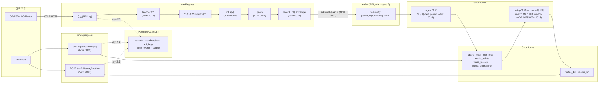

# 시스템 아키텍처 (구현 기준)

이 문서는 **지금 코드에 구현된** 시스템의 구조를 한 장으로 보여 준다. 목표 설계와 범위의 권위는 [D02](../specs/D02-system-data-api.md)이고, 각 결정의 이유는 ADR에 있다. 여기서는 둘을 잇는 지도와 실제 경계·실패 동작을 정리한다.

- 기준: 2026-10-05 main (metric_1h 반영), M0 1차 구현 범위
- 갱신 규칙: 구성 요소, 데이터 흐름, 저장소·계정, 신뢰 경계, 실패 동작이 바뀌는 PR은 이 문서를 같은 PR에서 고친다 ([문서화 규칙](../README.md#문서화-규칙)).

## 1. 구성 요소와 데이터 흐름

| 구성 요소 | 책임 | 쓰기 소유 데이터 | 구현 | 상세 |
|---|---|---|---|---|
| ingress | OTLP/HTTP 수신, 인증부터 Kafka append, ACK까지 | Kafka 수집 topic | `cmd/ingress` → `internal/ingest`, `internal/telemetry/{otlp,redact,envelope}`, `internal/quota` | [README](../../cmd/ingress/README.md) |
| worker (ingest) | Kafka 소비, 정규화, (tenant, event_id) dedup, ClickHouse 동기 insert, offset commit | 신호 원본, `ingest_quarantine`, consumer offset | `cmd/worker` → `internal/pipeline` | [README](../../cmd/worker/README.md) |
| worker (rollup) | 원본 metric을 1분·1시간 window로 각각 원본에서 재계산 | `metric_1m`(90일), `metric_1h`(395일) | `internal/rollup`, `internal/metricagg` | ADR 0025·0026·0028 |
| query-api | trace 단건 조회, metric 조회 | 없음 | `cmd/query-api` → `internal/query` → `internal/telemetrystore` | [README](../../cmd/query-api/README.md) |
| migrate | PG·ClickHouse schema, Kafka topic 생성과 설정 검증 | schema, topic | `cmd/migrate`, `migrations/` | [README](../../cmd/migrate/README.md) |
| 공통 | 인증·RBAC, 오류 envelope, HTTP 경계, 운영 지표 | — | `internal/{authz,apierr,httpapi,opsmetrics,controldb}` | [internal](../../internal/README.md) |

아직 없는 서비스(control-api, alert-worker, diagnostics-broker 등)는 [cmd/README](../../cmd/README.md)에서 단계별로 관리한다.

## 2. 신뢰 경계와 tenant 격리

tenant는 **인증 principal에서만** 얻는다(CLAUDE.md 계약 1). 저장소마다 앱 코드의 predicate 위에 DB가 강제하는 두 번째 방어선을 둔다.

| 경계 | 1차 방어 (앱) | 2차 방어 (DB가 강제) | 결정 |
|---|---|---|---|
| API key 인증 | `authz.Principal`, key = 저장 scope ∩ 발급자의 현재 role | key 조회 전용 RLS 정책(한 행) | ADR 0015, 0016 |
| 제어 DB | `controldb.WithTenant`가 트랜잭션마다 `app.tenant_id`를 binding | `ENABLE`+`FORCE RLS`, `montracer_rw` 최소 권한, superuser·BYPASSRLS·owner 계정이면 기동을 거부 | ADR 0016 |
| ClickHouse 조회 | tenant·시간·expires_at mandatory predicate | `SQL_montracer_tenant` row policy(설정이 없으면 0행), query 계정은 읽기 전용 | ADR 0018 |
| ClickHouse 쓰기 | envelope header의 tenant(ingress가 principal에서 넣음) | ingest 계정은 원본을 읽을 수 없음(읽을 수 있으면 worker 기동을 거부) | ADR 0018, 0021 |
| rollup | tenant별 watermark | rollup 계정에 전 tenant 읽기 정책을 명시적으로 부여 | ADR 0026 |
| 오류 응답 | 경계에서 한 번 변환. SQL·stack·다른 tenant의 존재를 노출하지 않음 | — | ADR 0014, 0022(존재를 숨기는 404) |

## 3. 내구성과 중복 의미

- **ACK 경계:** ingress는 정제된 record가 `acks=all`로 Kafka에 append된 뒤에만 2xx를 돌려준다. ACK는 "검색 가능"을 뜻하지 않는다(ADR 0002, 0020).
- **at-least-once:** worker는 ClickHouse에 durable insert한 뒤 offset을 commit한다. 재처리는 같은 insert token으로 하고, ClickHouse의 insert dedup window가 중복 batch를 버린다. token에는 행 내용 해시를 넣는다([PS-0001](../troubleshooting/PS-0001-offset-reuse-silent-loss.md)).
- **record dedup:** (tenant, event_id) 단위로 한다. 먼저 받은 값을 유지하고, 같은 ms에 받은 값은 Kafka offset 순서로 판정한다. metric의 상충 값은 quarantine한다(ADR 0021).
- **실패 격리:** 드라이버가 결정적으로 거부한 행만 `sink_rejected`로 quarantine하고, partition은 멈추지 않는다. quarantine에는 원문 없이 위치와 해시만 남긴다(계약 3).

## 4. 시간·집계 의미 (metric)

- window 배정은 관측 시각 기준이다. reset 판정과 cumulative 기준점, NaN 처리는 ADR 0025를 따른다.
- rollup watermark는 tenant별로 (관측 − 2분)이며, 입력이 없는 tenant에는 idle 60초를 적용한다. 10분 재계산 구간 안에서 바뀐 window만 단조 revision으로 다시 쓴다(ADR 0026).
- `metric_1h`는 `metric_1m`을 다시 합치지 않고 원본에서 같은 함수로 계산한다. 두 해상도의 의미가 정의상 같다(ADR 0028).
- 조회 해상도는 자동으로 고른다. `step_seconds`가 3600의 배수이고 `metric_1h`가 조회 시작을 덮으면 `metric_1h`를, 아니면 `metric_1m`을 읽는다. 누락 판정과 watermark는 읽은 해상도 기준이다(ADR 0028).
- 조회 API는 모든 step에 대해 값 또는 `null`+사유를 돌려주고, completeness와 missing 구간도 함께 준다. histogram은 bucket 원소별로 합한 뒤 percentile을 구한다(ADR 0027, 계약 5·6).

## 5. 실패 동작 요약

| 상황 | 동작 | 관측·대응 |
|---|---|---|
| Kafka append 실패·지연 | ingress 503(retryable), ACK 없음 | `montracer_ingress_*`, RB01 |
| tenant 한도 초과 | rate 초과 429+Retry-After, burst 초과 413, instance 과부하 503 | RB01 "tenant quota 조정" |
| 본문 한도 초과 | 413 (batch를 나누라는 신호) | [PS-0002](../troubleshooting/PS-0002-maxbytes-400-vs-413.md) |
| ClickHouse insert 실패 | offset 보류, 같은 token으로 60초까지 재시도한 뒤 종료하고 재시작 시 재처리 | `MontracerPipelineStalled`, RB01 |
| 특정 행 결정적 거부 | 그 행만 quarantine, 나머지 저장 | quarantine 사유별 계수 |
| 지표 listener 실패 | 기동 시에는 실패, 이후에는 로그만 남김(고객 경로 유지) | ADR 0023 |
| 권한이 과다한 DB 계정 | 기동 거부 | ADR 0016, 0021 |

## 6. 운영 지표

binary마다 별도 listener(`:9464`)로 `/metrics`를 노출한다. tenant·ID label은 금지한다. 경보 규칙과 promtool 시험은 `deploy/prometheus/rules/`에 있고, 경보마다 [RB01](../runbooks/RB01-kafka-backlog-and-store-failure.md)의 해당 절을 가리킨다(ADR 0023).

## 7. 결정 지도 (구성 요소 → ADR)

| 영역 | ADR |
|---|---|
| 기술 스택·버전 | 0001 OTel 우선 · 0003 ClickHouse 통합 저장소 · 0013 버전·이미지 고정 |
| 수집 | 0002 ACK 경계 · 0017 OTLP 한도 · 0019 PII · 0020 ingress·envelope·Kafka · 0024 quota |
| 처리 | 0021 worker·dedup·sink · 0025 metric window 의미 · 0026 rollup job · 0028 1시간 rollup·해상도 선택 |
| 저장·접근 | 0016 제어 DB · 0018 ClickHouse 계정·row policy |
| API | 0014 오류 처리 · 0015 key·role · 0022 trace 조회 · 0027 metric 조회(0028 해상도 선택) |
| 운영 | 0023 운영 지표·경보 |
| 검증 | [실험 0001](../experiments/0001-clickhouse-layout.md) ClickHouse layout |

## 8. 아직 구현하지 않은 것 (설계는 D02에 있음)

OTLP/gRPC, tail sampling(ADR 005 후보), metric backfill·window lease, query planner(`POST /query`), log·trace 검색, control-api, 경보 평가, 삭제 원장(ADR 008 후보), session 인증. 상태는 [작업계획서](../plan/work-plan.md)와 [requirements-registry](../plan/requirements-registry.md)에서 추적한다.
