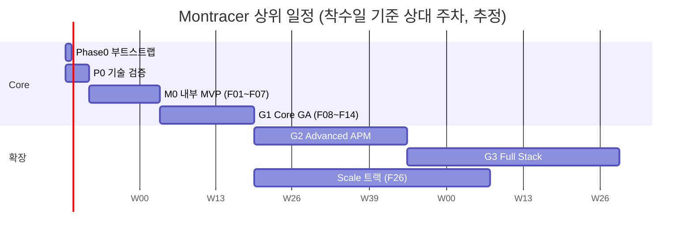
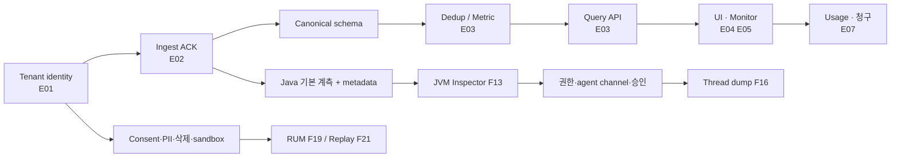

# Montracer 전체 작업계획서

- 버전: 1.0 (2026-10-03 작성)
- 근거: 개발 문서 세트 v2.0 [D01~D06](../specs/README.md)
- 상태: **계획(draft)** — 일정·인력·수치는 D06의 추정과 목표를 옮긴 것이며 확정 약속이 아니다. 범위·수치 변경은 ADR로 기록한다.

---

## 1. 목표와 성공 기준

Montracer는 서비스 상태 → 요청 단위 원인 조사 → JVM 내부 진단 → 사용자 경험까지 연결하는 B2B 관측(APM) 플랫폼이다. Datadog의 신호 통합·탐색 흐름과 Pinpoint의 Java 심층 진단을 벤치마킹하되, 검증 가능한 기능 단위로 제품화한다 (D01 §01).

| 구분 | 성공 기준 | 출처 |
|---|---|---|
| 제품 | 첫 trace 검색 p50 15분 / p90 30분, 고정 5개 장애 조사 시간 중앙값 30% 단축, 경보→관련 log 3단계 이하 | D01 §03, §07 |
| 시스템 SLO (GA) | 수집 가용성 99.95%, 검색 API 99.9%, 검색 p95 2초/p99 5초, 원본 freshness p99 60초, 경보 지연 p95 120초, 보존 대상 저장 99.99% | D01 §08 |
| 에이전트 부하 | CPU 상대 증가 ≤3%, 요청 p99 상대 증가 ≤5% (지원 matrix별 실측) | D01 §07~08 |
| 출시 차단 | P0 결함 0, cross-tenant 접근 0, secret fixture 잔존 0, 지정 부하 SLO, RPO/RTO 실측, 삭제 proof | D06 §04 |

**우선순위 원칙 (D01 §05):** P0 = 테넌트 격리·정확성·PII·내구성·삭제·복구 → 일정이 밀려도 생략하지 않는다. P1 = 조사 기능·운영 경험, P2 = 확장 통합. 일정 압박 시 P1/P2의 범위를 줄인다.

## 2. 변경 불가 계약 (모든 작업의 전제)

구현 전 팀 전체가 합의하고, 코드 리뷰·테스트로 강제한다 (D01 §02, D02).

1. **tenant_id는 인증 principal에서만 도출**한다. payload의 tenant_id, `X-Tenant-ID`는 권한 근거가 아니다.
2. **수집 ACK = 정제된 데이터의 Kafka durable append 완료** (acks=all, RF3, min.insync=2, idempotence). 검색 가능·영구 저장을 의미하지 않는다.
3. 전체 경로는 **at-least-once**. 중복 제거는 신호별 식별자 + 체크포인트로 하며 exactly-once라 부르지 않는다.
4. **PII 제거는 최초 영속 저장 이전**. redaction 실패 원문은 어디에도 남기지 않는다.
5. 시간·tenant·권한 scope·expires_at·삭제 tombstone은 **query의 mandatory predicate**로, 사용자 필터로 제거할 수 없다.
6. 오류율·지연 SLO는 **비샘플링 SDK metric**으로 계산한다. sampled trace로 전체 통계를 내지 않는다.
7. `missing / sampled / stale / partial / NO_DATA / EVALUATION_ERROR` 상태를 정상값·0과 혼동하지 않는다.

## 3. 단계와 마일스톤

| 단계 | 기간(착수 기준) | 범위 | Exit Gate |
|---|---|---|---|
| **Phase 0** 레포 부트스트랩 | 0주 (P0 첫 주와 병행) | 모노레포·toolchain·CI·로컬 stack 골격, ADR 001~003 확정 | `make doctor`/`make up PROFILE=lite` 동작, CI 필수 check 활성 |
| **P0** 기술 검증 | 1~4주 | canonical schema, tenant boundary, OTLP 수신, ClickHouse 부하 PoC | 2 demo tenant 교차 조회 거절, ACK crash 시험 통과, 3대 기술 검증 보고서 |
| **M0** 내부 MVP | 5~16주 | F01~F07 | 내부 pilot, trace→log 조사, 기본 경보, Q0~Q2 통과 |
| **G1** 유료 Core GA | 17~32주 | F08~F14 (+F18 기본) | 3AZ·삭제·복구·유료 원장·Java 진단, Q0~Q5 전 Gate 통과 |
| **G2** Advanced APM | 9~15개월 | F15~F20, F22 | 모듈별 Beta→GA, 추가 안전 시험(T01~T08) |
| **G3** Full Stack | 16~24개월+ | F21, F23~F25, F27 | Replay·CI·serverless·RCA·LLM 관측 |
| **Scale** 병행 트랙 | G1 이후 | F26 | 10배 부하, Cell 이동, 지역 DR |



> 날짜는 2026-10-05 착수를 가정한 예시다. 실제 착수일에 맞춰 이동한다.

### 선후 관계 (critical path, D06 §01)



## 4. 팀 구성 (D06 §01)

| 단계 | 인원 | 구성 |
|---|---|---|
| Core (P0~G1) | 11~12명 | Backend/Data 4, Frontend 2, Agent 2, SRE 1, QA 1, PM/Design 1~2 (+공유 Security·Legal) |
| G2/G3 | 16~20명 또는 일정 연장 | Agent·Frontend·Data·SRE 전문 인력 보강 |

보안 reviewer 없이는 release하지 않는다. CODEOWNERS로 protocol·tenant boundary·PII·DB migration·cost-sensitive query에 전문 reviewer를 지정한다.

---

## 5. 단계별 상세 작업

체크박스는 진행 추적용이다. 각 작업은 `[Epic / F ID / 담당]`과 완료 증거를 갖는다. 상태의 단일 원천은 [요구사항 Registry](requirements-registry.md)다.

### 5.0 Phase 0 — 레포 부트스트랩 (0주)

D06 §10~11의 레포 규약을 구현한다.

- [x] **ADR 001~003 확정** (2026-10-03 승인) (OTel 우선 / Kafka ACK 경계 / ClickHouse 통합) — Tech lead [docs/adr](../adr/README.md)
- [x] 버전 선정·고정: Go, Node, 패키지 매니저, PostgreSQL, ClickHouse, Kafka, OTel Collector (이미지 digest + lockfile, `latest` 금지) — Platform ([ADR 0013](../adr/0013-toolchain-and-image-pinning.md))
- [x] 모노레포 골격 생성 (디렉터리·README) — Platform
  ```
  apps/web/            cmd/{ingress,query-api,control-api,worker,alert-worker}/
  internal/{authz,telemetry,query,pipeline}/
  api/{openapi,proto}/ migrations/{postgres,clickhouse}/
  deploy/{compose,helm}/ infra/ tests/{fixtures,load}/
  ```
- [x] Makefile 개발 경험 계약 골격 (`doctor`·`bootstrap` 동작, 나머지는 미구현 안내) — Platform
- [x] Makefile `up PROFILE=lite`·`down`·`ps`·`logs`·`clean-data`·`test`·`lint` 구현 — Platform
- [x] Makefile `migrate`(PostgreSQL)·`migrate-status`·`test-integration` 구현 — Platform
- [ ] Makefile `seed`·`dev`·`smoke`, ClickHouse migrate 구현 (P0 Sprint 1~2에서 해당 코드와 함께) — Platform
- [x] Go module·pnpm workspace 생성 — Platform
- [x] `deploy/compose` lite profile: PG, Kafka 단일 broker, ClickHouse, Collector — SRE
- [x] CI 기본 파이프라인: format·lint·type check·unit·secret scan·dependency scan — SRE (`.github/workflows/ci.yml`)
- [x] GitHub 원격 저장소 생성, main protected branch 설정 (필수 CI 4개·PR 필수·linear history·force push/삭제 금지·관리자 포함) — SRE
- [ ] 리뷰어가 2명 이상이 되면 required review 1명(보안 경계 2명)으로 상향 — SRE
- [x] CODEOWNERS, PR 템플릿(F ID·Epic·schema 변경·tenant 영향·retention 영향·rollout plan) — Tech lead (팀 handle 확정 시 CODEOWNERS 갱신)
- [x] `.env.example`(가짜 credential만) — Security
- [x] secret pattern CI 검사 (gitleaks) — Security

**완료 증거:** 새 개발자가 `make doctor && make up PROFILE=lite`를 30분 안에 통과.

### 5.1 P0 — 기술 검증 (1~4주)

#### Sprint 1 (1~2주) — D06 §02

- [x] Tenant principal 모델과 공통 error envelope (D02 §12) — E01 / Backend (`internal/authz`, `internal/apierr`; OIDC·HTTP middleware·key 저장소는 후속)
- [x] OTLP fixture decoder: golden OTLP JSON/proto fixture, 가짜 PII fixture — E02 / Data (`internal/telemetry/otlp`, `tests/fixtures/{otlp,pii}`)
- [ ] ClickHouse layout 실험: `spans_local`, `logs_local`, `metric_points` (D02 §09~10) — E03 / Data — **부분 완료**: migration·계정 분리·row policy·예산·trace 조회·spans smoke 측정 완료. 목표 밀도 측정, logs·metric 쿼리 측정, 실제 OTLP payload 크기 측정은 남음 ([실험 0001](../experiments/0001-clickhouse-layout.md))
- [x] PostgreSQL outbox + RLS 골격 (`SET LOCAL app.tenant_id`, BYPASSRLS 없는 앱 role) (D02 §11) — E01 / Backend
- [ ] UI shell, 전역 context(org·env·time range) 토큰 (D05 §01~02) — E04 / FE
- [ ] CI container digest pin — SRE

**Sprint 1 완료:** demo tenant 2개에서 교차 조회가 거절되고, redacted fixture가 Kafka에 들어간다.

#### Sprint 2 (3~4주)

- [ ] Durable ACK + retry 시험 (Kafka append 직후·ACK 전 연결 단절) — E02
- [ ] trace/log identity (trace: tenant+trace_id+span_id, log: source_id+generation+offset) (D02 §05) — E02
- [ ] metric reset oracle (cumulative reset, out-of-order, duplicate delta…) (D06 §04) — E03
- [ ] trace query API + waterfall mock — E03/E04
- [ ] redaction failure path (원문 미보존 거절) — E02 / Security
- [ ] staging health + SLO skeleton — SRE

**Sprint 2 완료:** Kafka append 직후 연결 단절 시험에서 보존 대상이 회복되고 logical 중복이 없다.

#### 2주 내 기술 검증 3건 (D06 §08)

- [ ] **Sampler recovery**: partition rebalance·crash 후 decision 복구 PoC
- [ ] **Metric histogram 저장 byte** 실측 (32B/point 가정 검증, D02 §18)
- [x] **ClickHouse multi-tenant query latency** — 목표 밀도(3,600만 span)에서 단일 서비스 최근 1h 검색 p95 24ms ([실험 0001](../experiments/0001-clickhouse-layout.md)): 10 tenant·100 서비스·10k spans/s에서 p95 2초 가능성

결과가 기본안 가정을 깨면 구현량이 적더라도 해당 ADR을 다시 연다.

### 5.2 M0 — 내부 MVP (5~16주, Sprint 3~8)

F01~F07. 각 Sprint는 2주, demo는 기능 버튼이 아니라 end-to-end 시나리오로 한다.

| Sprint | 주차 | 핵심 목표 | 데모 시나리오 |
|---|---|---|---|
| S3 | 5~6 | Ingress 완성(F01), Worker sink·dedup, trace 저장 | OTLP 3신호 수집 → Kafka → CH |
| S4 | 7~8 | Query API(F04 기반), Trace Explorer·Detail(F02) | 오류 trace 검색 → waterfall |
| S5 | 9~10 | Metric 정규화·rollup, Service catalog·RED·map(F03) | 서비스 목록 → 상세 RED |
| S6 | 11~12 | Trace↔Log 연결, Logs 화면, 저장 검색·공유 URL(F04) | 오류 trace → 관련 log (3단계 이하) |
| S7 | 13~14 | Monitor·webhook(F06), Dashboard 6위젯(F05) | 오류율 경보 → deep link |
| S8 | 15~16 | OIDC·RBAC·키·PII·quota·usage(F07), 하드닝, 내부 pilot | 설치(UC01) → 조사(UC02) → 비용(UC03) |

#### E01 Tenant와 Identity (F07) — Backend/Security
- [ ] OIDC Authorization Code + PKCE, 세션 cookie(Secure·HttpOnly·SameSite=Lax) + CSRF, idle 30분/최대 12시간 (D04 §02)
- [ ] 조직 RBAC: Viewer / Developer / Operator / Tenant Admin / Security Auditor (D04 §01)
- [ ] Ingest key: 256-bit, key_id prefix + keyed hash constant-time 비교, scope·만료·revoke, 원문 1회 노출
- [ ] Key revoke 60초 내 반영, 정책 cache miss 시 fail closed
- [ ] IDOR negative suite (모든 ID·cursor 재사용 시 비노출) — 완료 증거

#### E02 Ingest와 Quality (F01) — Data
- [ ] OTLP/gRPC + OTLP/HTTP(`/v1/traces|metrics|logs`), protobuf·JSON, gzip, 압축 해제 후 8MiB 제한 (D02 §04)
- [ ] 처리 순서: 인증 → 압축 한도 → decode → tenant 주입 → 속성 검증 → PII 제거 → quota → envelope → Kafka append
- [ ] partial success 응답, 429/503 Retry-After, 413 분할 안내
- [ ] tenant별 weighted fair queue + byte·record token bucket
- [ ] envelope(tenant_id, signal, schema_version, event_id, event_time, ingress_received_at, policy_version, routing_epoch) + 파티션 키
- [ ] Head sampling(parent-based, 기본 10%) (D02 §06)
- [ ] 시간 범위 검증: 미래 5분·과거 24시간 초과 거절
- [ ] Quarantine 24시간(PII 제거 후 최소 payload)
- [ ] 완료 증거: OTLP golden·PII fixture·ACK crash 시험, gzip bomb·긴 속성 fuzz

#### E03 Storage와 Query (F02, F04) — Data/API
- [ ] Worker: partition 순서 batch, CH 동기 insert 후 offset commit, batch token + record key
- [ ] trace/log query 시 bounded dedup (FINAL 전체 scan 금지)
- [ ] Metric: stream identity fingerprint, temporality·reset 처리, histogram bucket 병합, watermark(최대 관측-2분), 10분 late 재계산, `metric_1m`/`metric_1h` rollup (D02 §07, §10)
- [ ] Cardinality quota: 조직 100k series, label key 20, key당 값 100, 금지 dimension
- [ ] Query planner: JSON AST(깊이 4·leaf 20·in 100), field catalog, parameter binding, mandatory predicate 강제 (D02 §15)
- [ ] 실행 예산: 조직 동시 5/대기 20, 10GB scan, 5초 timeout, async job 전환
- [ ] HMAC 서명 cursor(15분), snapshot_ingest_time, `meta.watermark/partial/sampled/coverage`
- [ ] API: `POST /query`, `/query/traces|logs|metrics`, `GET /traces/{id}`, `GET /services`, `POST /service-map/query`, `/query-jobs`, `GET /capabilities` (D02 §13, §19)
- [ ] OpenAPI 3.1 원천 + breaking-change 검사 + consumer contract test
- [ ] 완료 증거: dedup oracle(동일 batch 3회 재전송 동일 결과), budget 초과 거절, cursor 일관성

#### E04 Core 조사 UI (F02, F03, F04) — FE/Design
- [ ] 디자인 토큰(light/dark), 레이아웃·반응형 (D05 §02)
- [ ] 공통 컴포넌트: TimeRangePicker, QueryBar, FacetPanel, DataTable, MetricChart, EntityDrawer, StatusBadge, ConfirmDialog — 상태 계약 포함 (D05 §03)
- [ ] 화면: S01 Overview, S02 Service Detail, S03 Map, S04 Trace Explorer, S05 Trace Detail, S08 Logs/Metrics (D05 §04~08)
- [ ] 서버 상태 키에 tenant·auth fingerprint 포함, 401/403/404/429/503 처리 규칙
- [ ] log·stack·SQL text-only 렌더링, CSP
- [ ] 완료 증거: S02~S05 E2E, keyboard-only, 대비, 10k span·200 node 성능 예산

#### E05 Monitor와 Dashboard (F05, F06) — API/FE
- [ ] Dashboard CRUD, 6종 위젯, 변수(environment·service·team), revision 충돌 409/412, 최대 50 위젯 (D02 §14, D05 §10~11)
- [ ] Monitor validate(dry-run)·CRUD, scheduler lease + idempotency, 상태 머신 OK→PENDING→ALERT→RECOVERING, NO_DATA·EVALUATION_ERROR 분리 (D02 §17)
- [ ] 상태 전이 + notification outbox 동일 트랜잭션, webhook HMAC 서명, SSRF 차단(사설 IP·metadata·DNS rebinding)
- [ ] 화면 S09 Monitor, S10 Dashboard
- [ ] 완료 증거: metric oracle, outbox dispatcher crash 시험, 2% 경계 시험(정확히 2%는 미발화)

#### M0 공통
- [ ] `make seed SCENARIO=checkout`: checkout→payment→database 샘플, 2 tenant, 알려진 장애 fixture (재실행해도 logical 중복 없음)
- [ ] `make smoke`, `make test-contract`, `make test-isolation`
- [ ] 기본 부하 시험(10k spans/s, 5k logs/s, 100k series) 1회 + 결과 보고 (D06 §03)
- [ ] 내부 pilot 시작, 사용성 시험(개발자 5명 이상 설치 관찰) 준비
- [ ] **M0 Gate:** Q0 계약, Q1 보안, Q2 정확성

### 5.3 G1 — 유료 Core GA (17~32주)

| 영역 | 작업 | F / Epic | 완료 증거 |
|---|---|---|---|
| Enterprise identity | 팀·환경 scope, SAML·SCIM, 조회 감사, step-up(MFA) | F08 / E01 | 권한 회수 후 stream 60초 내 종료 |
| 운영 HA | 3AZ Kafka, CH 복제(ReplicatedReplacingMergeTree + Distributed), PG HA, 복구 훈련 | F09 / E07 | AZ failover·restore 실측 RPO/RTO (D04 §05) |
| 삭제 | deletion job 상태 머신, tombstone·policy epoch, 15분 접근 차단, 24시간 live 물리 삭제, restore 시 원장 재적용 | F09 / E07 | 삭제 proof (raw·rollup·index·object·export 재조회) |
| 과금 | 불변 usage ledger, 단위(trace GB, log GB, series-hour…), 대사·정정·invoice hold, 예산 80/100% 알림, soft/hard cap | F09 / E07 | T09 (retry·replay·늦은 event·plan 변경) |
| Tail sampling | stateful sampler worker, decision_wait 30초, checkpoint/changelog, late_span·partial_trace 표시, budget_drop 공개 | F10 / E02 | 3배 피크·trace 쏠림 시험, 오류 trace 보존율 100%(budget 미포화) |
| 경보 고도화 | SLO burn rate(14.4x/6x multi-window), composite monitor(Kleene 3값), mute·escalation·사건 timeline | F11 / E05 | S09/S10 E2E, UNKNOWN을 정상으로 치환하지 않음 |
| 요청 분석 | 요청 scatter, URI 통계, 영역 선택 → 동일 필터 재현 | F12 / E04 | 공유 URL 재현성 |
| Java 진단 | JVM Inspector(15초 runtime sample, active request age bucket, boot_id), stale 표시, S06 화면 | F13 / E06 | T01 (JDK 17·21 matrix) |
| 오류 분석 | call tree, SQL template, 예외 chain, error grouping·transition | F14 / E06 | S07 화면, fingerprint 안정성 |
| Thread dump (제한 Beta) | 승인 상태 머신, 요청자·승인자 분리, TTL 120초, nonce, kill switch | F16 Beta / E06 | T02 (무승인 실행 0, 민감값 0) |
| Infra 연결 | host·container·K8s ↔ 서비스, metadata TTL | F18 기본 | 연결 정확도 |
| 운영 준비 | RB01~RB04 runbook, 플랫폼 자체 관측(D04 §10), 당직, 지원 절차 | E07 | Q5 운영 Gate |
| 릴리스 엔지니어링 | reproducible build, SBOM, provenance, image 서명, canary(내부→pilot 1곳→5→25→100%) | E07 | Canary 중단 기준 자동화 |

- [ ] 고객 pilot 3곳 (서로 다른 Java stack·K8s topology)
- [ ] 부하 시험 전 시나리오: 기준·Burst·Soak 24h·Noisy tenant·저장 장애·Dashboard (D06 §03)
- [ ] 용량 확정: 실측 byte를 D04 §06 산식에 대입, 최저 SLO 통과 용량 × 1.5
- [ ] **G1 Gate:** Q0~Q5 전부 + 출시 차단 기준 (§1)

### 5.4 G2 — Advanced APM (9~15개월)

모듈별 독립 Beta→GA. 하나의 GA가 다른 모듈의 안전성을 증명하지 않는다.

| F | 기능 | 핵심 작업 | 인수 |
|---|---|---|---|
| F15 | Continuous Profiling | CPU·alloc 60초 profile, object store + manifest, flame graph, 배포 비교, trace overlap | T03 |
| F16 | Thread dump GA·Dynamic probe | 지원 JVM matrix, 안전 예산, probe TTL·quota·kill switch | T02, T04 |
| F17 | DBM (PostgreSQL·MySQL) | query digest, wait, plan 비교, literal 비저장 | T05 |
| F18 | Infra 확장 | 통합 팩, K8s 확장 | — |
| F19 | Browser RUM | Web Vitals, JS error, view↔trace, consent | T06 |
| F20 | API Synthetic | 사설 runner, SSRF·DNS rebind 방어, 이중 청구 0 | T08 |
| F22 | Kafka 관측 | lag, message pathway, 처리 지연, payload 미수집 | — |

선행: Profile/DBM은 E06 이후, RUM은 consent·PII·삭제·sandbox 이후 (D06 §01). Workload matrix(profile 100 instances, RUM 1M events/day, DBM 100 instances)로 확장 부하 시험 (D06 §06).

### 5.5 G3 — Full Stack (16~24개월+)

| F | 기능 | 전제 |
|---|---|---|
| F21 | Browser Synthetic·Session replay | replay 기본 off, 마스킹 회귀(T07) 전 계층 통과 |
| F23 | 배포·CI pipeline·test 연결, flaky 분류 | 통합 팩 CI |
| F24 | Serverless cold start·클라우드 API 통합 | credential 격리 |
| F25 | Anomaly·change detection·RCA 가설 | 근거와 신뢰도 표시, 자동 복구 금지 |
| F27 | LLM span·token·비용 metadata | prompt 기본 미수집 |

### 5.6 Scale 트랙 (G1 이후 병행)

- [ ] F26 전용 Cell, 사설망 패키지(Helm 재사용), DR, 감사 export
- [ ] Cell 이동 절차(epoch 증가, 이전 writer 차단, 기간별 query router) (D02 §02, D04 §07)
- [ ] 10배 부하 + 100 동시 query 시험 (Scale gate)

---

## 6. 품질 전략

### 6.1 테스트 계층 (D06 §04)

| 계층 | 필수 검증 | 실행 시점 |
|---|---|---|
| Unit | AST, metric reset, histogram 병합, RBAC, redaction | 모든 PR |
| Property/Fuzz | timestamp overflow, 압축·protobuf, Unicode, ID | PR smoke + nightly |
| Integration | Kafka replay, CH insert 재시도, PG RLS/outbox | merge 전 ephemeral stack |
| Contract | OTLP JSON/proto, OpenAPI, SDK 호환 | release matrix |
| E2E | 설치→trace→log→monitor→삭제 | staging 매일 + release |
| Security | tenant escape, SSRF, key revoke, XSS, secret fixture | P0는 PR, 전체는 release |
| Chaos/DR | broker·AZ·downstream 중단, restore | 월 일부 / 분기 전체 |

### 6.2 장애 주입 지점 (반드시 재현)

1. Kafka append 완료 직후 · ACK 전 연결 단절
2. ClickHouse insert 성공 직후 · offset commit 전 crash
3. Sampler decision 직후 · output 전 crash
4. Outbox commit 직후 · dispatcher crash
5. Tenant 삭제 중 replay, backup restore 후 삭제 재적용, revoke 직후 SSE reconnect

### 6.3 출시 Gate (D06 §06)

| Gate | 차단 조건 | 승인 |
|---|---|---|
| Q0 계약 | schema·identity·API 모호성 미해결 | Tech lead, Data |
| Q1 보안 | tenant 노출·PII fixture·무승인 진단 1건 이상 | Security |
| Q2 정확성 | duplicate 집계·잘못된 SLO·청구 불일치 | Data, QA |
| Q3 신뢰성 | 지정 부하 SLO·AZ failover·restore 실패 | SRE |
| Q4 UX | keyboard 과업 불가·상태 오표시·오류 숨김 | Design, QA |
| Q5 운영 | runbook·당직·rollback·지원 매뉴얼 부재 | 운영 책임자 |

### 6.4 공통 DoD (D06 §02)

코드 · 공개 API · DB migration · 문서 · 단위/통합/negative test · metric · runbook · 위험 검토 · rollback 계획이 같은 PR 또는 연결 issue에 있어야 한다. 기능 flag off 경로도 시험한다. API 예제·UI fixture는 schema로 검증한다.

## 7. 위험 관리 (D06 §08~09)

| 위험 | 가능성·영향 | 완화 | Owner |
|---|---|---|---|
| Metric cardinality 폭증 | 높음·높음 | 신규 series quota, 비용 preview | Data lead |
| Sampling 편향·불완전 trace | 높음·중간 | SDK metric SLO, completeness UI | Data lead |
| 테넌트·PII 유출 | 중간·매우 높음 | 다층 auth, fixture, fail closed | Security |
| Storage 운영 부담 | 중간·높음 | 관리형 비교, backup·merge runbook | SRE |
| Log 검색 기대 불일치 | 높음·중간 | capability 명시, pilot 검증 | PM |
| 비용 산정 오차 | 높음·높음 | 실측 byte/point, 25% 예비비 | SRE |
| Agent JVM 불안정 | — | 지원 matrix·canary·kill switch | Agent lead |
| Scope 과확장 | G1 4주 지연 시 | G2/G3 독립 투자로 분리 | PM |

주간 검토에서 owner·trigger·기한·잔여 위험을 갱신한다.

## 8. 착수 전 결정 필요 사항

문서에서 "구현 시작 시 선정"으로 남겨둔 항목. P0 1주차에 결정하고 ADR로 남긴다.

| # | 항목 | 문서 기본안 | 결정 주체 |
|---|---|---|---|
| 1 | 클라우드 공급자·데이터 거주 지역 | 단일 지역 SaaS | CTO/SRE |
| 2 | 관리형 Kafka·ClickHouse 사용 여부 | 관리형 Kafka 권장, CH는 비교 | SRE |
| 3 | 언어·런타임 버전 (Go, Node, JDK matrix) | Go + React/TS, JDK 17·21 우선 | Tech lead |
| 4 | Frontend 라이브러리 (router, server state, chart, 가상화) | React + TS, 서버 상태 라이브러리 | FE lead |
| 5 | OTel Collector 배포판·버전 | contrib 검증 배포판 | Agent lead |
| 6 | M0에서 control/query 단일 binary 운영 여부 | 허용 (package·DB ownership 분리) | Tech lead |
| 7 | 브랜치·커밋 규약 | Conventional Commits 선택, 보안 contract test 우선 | Tech lead |
| 8 | 실제 착수일·인력 확보 현황 | Core 11~12명 | PM |

## 9. 진행 관리

- **요구사항 Registry**: F01~F27의 상태(planned/experimental/beta/GA/deprecated)와 release tag → [requirements-registry.md](requirements-registry.md). 완료율을 endpoint 개수로 계산하지 않는다. Gate 증거 없는 기능은 planned/beta.
- **Sprint**: 2주. Sprint demo는 end-to-end 시나리오(UC01~UC07).
- **범위 조정**: PM이 4주마다 pilot 가치와 구현 비용으로 범위를 조정하고 인수 조건을 함께 승인 (ADR 012).
- **ADR**: [docs/adr](../adr/README.md). 변경 시 superseded 표시, 삭제 금지.
- **Release tag**: Gate별 증거 URI와 checksum 첨부. 인수 결과에 version·workload seed·실측치·실패/재시험·승인자 기록.
