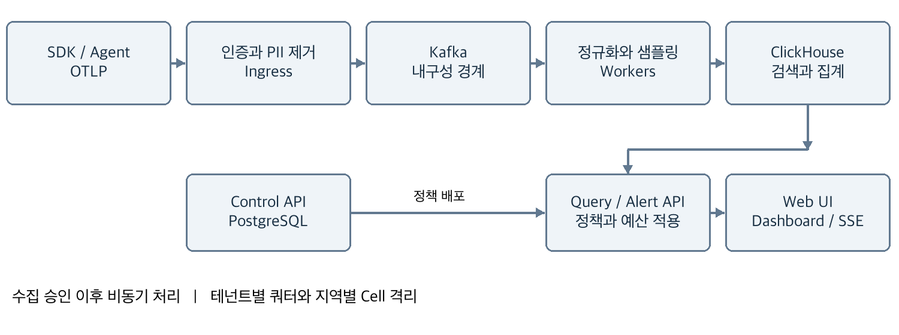

# D02 시스템 데이터와 API 설계

> Montracer 개발 문서 세트 v2.0 (기준일 2026-10-03) · 원본: [`original/D02_Montracer_시스템_데이터와_API_설계.docx`](original/D02_Montracer_시스템_데이터와_API_설계.docx)  
> 이 파일은 `scripts/docs/convert_specs.py`로 생성한 파생본이다. 내용 변경은 원본 개정 + ADR로 한다.

Backend와 Data 개발자가 구현할 수집 승인, 저장 정합성, 검색, API와 처리 알고리즘을 정의한다. 모든 신호에 tenant와 삭제 정책을 강제하고 재처리를 견디는 계약을 우선한다.

### 사용 기준

제품 요구 F01~F27과 출시 범위는 D01을 기준으로 한다. 본 문서의 성능·보존·용량 수치는 구현 목표 또는 명시한 가정이며 실제 출시에는 D06 시험 증거와 승인 절차가 필요하다.

| **문서** | **읽는 목적**            |
|----------|--------------------------|
| D01      | 제품 요구사항과 벤치마크 |
| D02      | 시스템 데이터와 API 설계 |
| D03      | 계측과 고급 진단 설계    |
| D04      | 보안 운영과 상용화       |
| D05      | UX UI 디자인 명세        |
| D06      | 개발 실행과 품질 계획    |

### 참조 방법

D 번호는 문서, 절 번호는 각 문서의 목차 항목이다. B01~B16의 공개 벤치마크 원문은 D01 마지막 절, R1~R11의 표준과 엔진 근거는 D02 마지막 절에서 확인한다. 사용자·API·스키마·운영의 정의가 다르면 권위 문서를 수정한 뒤 계약 테스트를 갱신한다.

### 문서 상태

상용 구현과 인수 기준을 제안하는 설계 버전이다. 기능 완료, 보안 인증, 지원 계약 또는 확정 견적을 대신하지 않는다. 범위와 수치 변경은 revision 및 ADR로 기록한다.

## 목차

절 제목을 선택하면 해당 설계로 이동한다. 

[01 기술 스택과 대안](#01-기술-스택과-대안)

[02 전체 시스템 아키텍처](#02-전체-시스템-아키텍처)

[03 서비스 경계와 소유권](#03-서비스-경계와-소유권)

[04 Ingest 프로토콜과 내구성](#04-ingest-프로토콜과-내구성)

[05 파이프라인과 중복 제거](#05-파이프라인과-중복-제거)

[06 Sampling 설계](#06-sampling-설계)

[07 신호 연결과 Metric 의미](#07-신호-연결과-metric-의미)

[08 Service Catalog와 Service Map](#08-service-catalog와-service-map)

[09 Trace와 Log 저장 모델](#09-trace와-log-저장-모델)

[10 Metric 저장과 집계 모델](#10-metric-저장과-집계-모델)

[11 제어 데이터와 트랜잭션](#11-제어-데이터와-트랜잭션)

[12 공통 API 계약](#12-공통-api-계약)

[13 조회 API 상세 명세](#13-조회-api-상세-명세)

[14 관리 API와 변경 이벤트](#14-관리-api와-변경-이벤트)

[15 Query와 Search 실행 설계](#15-query와-search-실행-설계)

[16 실시간 스트리밍](#16-실시간-스트리밍)

[17 Monitor와 Alert 상태 머신](#17-monitor와-alert-상태-머신)

[18 확장 데이터 모델과 인덱스](#18-확장-데이터-모델과-인덱스)

[19 Query API 타입과 오류 계약](#19-query-api-타입과-오류-계약)

[20 제어 API와 확장 API 계약](#20-제어-api와-확장-api-계약)

[21 시간 집계와 데이터 회계 보완](#21-시간-집계와-데이터-회계-보완)

[22 핵심 처리 알고리즘](#22-핵심-처리-알고리즘)

[23 근거 자료와 표준 경계](#23-근거-자료와-표준-경계)

## 01 기술 스택과 대안

| **영역** | **기본안과 이유** | **대안과 전환 조건** |
|----|----|----|
| 수집과 API | Go, gRPC와 HTTP, 단순 배포와 동시성 | Java는 팀 전문성 우위 시, Rust는 병목 증명 후 |
| 계측 | OTel SDK와 Collector contrib 검증 배포판 | 자체 agent는 필수 누락 기능만 확장 |
| 메시지 버퍼 | 관리형 Kafka, replay와 partition 처리 | 직접 저장은 로컬만, 호환 제품은 라이선스 검토 |
| 분석 저장소 | ClickHouse, 세 신호 SQL 집계 통합 | trace는 Tempo, log는 Loki로 운영비 비교 가능 |
| metric 확장 | MVP ClickHouse의 제한된 metric 쿼리 | Mimir 등 전용 TSDB로 PromQL 요구 대응 |
| 제어 저장소 | PostgreSQL, 트랜잭션과 RLS | 단일 KV로 변경 시 관계·정합성 구현 부담 |
| UI | React, TypeScript, 가상화 trace 목록 | 기존 사내 UI 기술이 있으면 재사용 |
| 실행과 배포 | Kubernetes, Helm, GitOps, IaC | 작은 내부 환경은 VM, GA 운영 표준은 K8s |

### 선정 이유와 비용

한 저장 엔진에 trace·log·metric을 모으면 초기 운영과 correlation이 단순해진다. 대신 metric temporality, histogram 병합과 검색 DSL을 직접 구현해야 한다. ClickHouse는 임의 log 전문 검색이나 PromQL 호환을 자동 제공하지 않는다. 제품 요구가 이 방향으로 커지면 별도 엔진을 추가한다.

Kafka를 MVP부터 넣는 이유는 ACK 의미와 장애 시 replay를 고정하기 위해서다. 비용을 줄이려 삭제하면 가용성·데이터 계약이 바뀐다. 외부 관리형 서비스를 사용해 운영 부담을 줄이되 데이터 지역, 백업 이동, 공급자 장애와 네트워크 비용을 검토한다.

### 버전과 라이선스 관리

Go·Node·PostgreSQL·ClickHouse·Kafka·Collector는 구현 시작 시 지원 중인 안정 버전을 선정하고 이미지 digest와 lockfile로 고정한다. main 또는 latest 태그를 배포하지 않는다. 본 설계는 특정 미래 버전에 의존하지 않는다. Collector component의 안정성 및 옵션은 고정 버전의 validate 명령과 통합 시험으로 확인한다.

Apache 계열, AGPL 계열 및 상용 배포판의 의무는 사용·수정·배포 형태별로 검토한다. 전용 TSDB나 검색 엔진을 추가할 때 보안, 백업, 권한 모델과 총 운영 인력을 포함한 ADR을 승인한다. 출시 전 SBOM과 NOTICE를 생성한다.

## 02 전체 시스템 아키텍처



*그림 1 데이터 흐름과 제어 경계*

### 데이터 평면

SDK와 node agent는 OTLP로 지역 ingress에 전송한다. ingress는 인증, 압축 해제 한도, schema 검증, quota, PII 제거를 수행한 후 Kafka에 기록한다. worker는 신호별 정규화와 dedup, 집계 및 선택적 tail sampling을 수행한다. ClickHouse의 원본·집계 테이블이 query API를 제공한다.

metric과 서비스 요청 집계는 trace sampling 이전 경로에서 만들어야 한다. 운영 SLO의 기본 자료는 SDK metric이며 span 기반 파생 metric은 보조 자료다. sampling된 trace만으로 전체 요청 오류율을 계산하지 않는다.

### 제어 평면

PostgreSQL은 조직, 사용자, 역할, 키 metadata, dashboard, monitor, 정책, 삭제 job, audit index를 저장한다. 변경은 트랜잭션과 outbox에 함께 기록하고 worker가 버전 있는 정책 snapshot을 받는다. 제어 저장소 장애 중 수집은 마지막 유효 정책으로 최대 15분 지속하며, 키 폐기 상태 확인 불가가 60초를 넘으면 해당 인증 경로는 fail closed한다.

Kafka에는 tenant_id를 서버가 주입한다. 개별 Kafka header나 SQL 조건을 고객이 직접 지정할 수 없다. query service만 ClickHouse에 접근하며 사용자에게 DB 자격증명을 발급하지 않는다. live tail과 알림도 동일한 권한 필터를 적용한다.

### Cell 확장

Cell은 ingress, Kafka, worker, ClickHouse를 묶은 장애·용량 단위다. tenant routing registry가 조직을 한 지역·한 Cell에 배정한다. 큰 고객은 전용 Cell로 이동한다. 전환 시 epoch를 올리고 이전 writer를 차단하며, 과거 데이터는 기간별 query router로 합친다. 단순 DNS 변경만으로 데이터 이동이 끝나지 않는다.

## 03 서비스 경계와 소유권

### 컴포넌트별 책임

| **서비스** | **쓰기 소유 데이터** | **동기 의존과 장애 동작** |
|----|----|----|
| ingress | 정제된 canonical Kafka topic | 정책·키 cache 만료 시 fail closed |
| pipeline worker | 신호 원본과 처리 checkpoint | sink 실패 시 offset 보류 |
| query API | query job와 일시 cache | mandatory predicate 불가 시 거절 |
| control API | tenant·정책·revision·outbox | PostgreSQL 불가 시 mutation 중단 |
| alert worker | evaluation·episode·notification | query 실패는 EVALUATION_ERROR |
| diagnostics broker | 승인된 job와 agent channel | 만료 후 전송·실행 금지 |
| profile와 replay worker | 정제 객체·index manifest | 객체 finalize 전 검색 비노출 |
| usage worker | 불변 usage ledger와 정정 항목 | 대사 실패 시 청구 보류 |

### 트랜잭션 경계

제어 API 변경, 감사, outbox는 같은 PostgreSQL transaction이다. PostgreSQL과 Kafka 사이 distributed transaction을 만들지 않는다. outbox relay는 재시도하며 소비자가 event_id·revision으로 중복과 역순을 처리한다. telemetry sink의 Kafka offset은 목적지 durable write 이후 commit한다.

객체 업로드는 pending manifest 생성 → 제한된 upload gateway로 전송 → 메모리 내 checksum·size·redaction 검증 → 정제 객체 저장 → ready manifest commit 순이다. 고객의 object store 직접 쓰기는 허용하지 않으며 정제 실패 원문은 저장하지 않는다. multipart 미완료는 24시간 후 정리한다. 객체 저장 후 manifest commit이 실패하면 orphan GC가 회수한다. 삭제 원장을 통과하지 않은 object는 ready가 될 수 없다.

### 신뢰 경계와 네트워크

인터넷 경계, tenant context 경계, 제어와 데이터 평면 경계, 고객 agent와 진단 명령 경계를 분리한다. ingress는 고객 supplied tenant attribute를 저장 identity로 사용하지 않는다. query cache·async job·signed export·profile symbol·replay chunk에도 같은 tenant context를 적용한다. 외부 provider 장애가 주 수집 plane을 재시작시키지 않도록 connector pool을 격리한다.

이 경계에서 Go module과 배포 서비스는 반드시 1대1일 필요가 없다. M0에서는 control/query를 같은 binary로 운영할 수 있지만 package와 DB ownership은 분리한다. 임의의 여러 서비스가 같은 제어 table을 직접 수정하는 shared database 패턴을 금지한다.

## 04 Ingest 프로토콜과 내구성

### 요청 계약

외부 수신은 TLS 443에서 OTLP/gRPC 및 OTLP/HTTP를 제공한다. HTTP 경로는 /v1/traces, /v1/metrics, /v1/logs이며 내부 Collector 기본 포트는 4317·4318이다. protobuf와 OTLP JSON을 지원하고 gzip을 허용한다. 압축 해제 후 8MiB 제한과 record 단위 한도를 별도로 둔다.

인증 → 압축 해제 한도 → decode → 서버 tenant 주입 → 속성 검증 → 개인정보 제거 → quota → canonical envelope → Kafka append 순서로 처리한다. 원본 payload, 인증 header, log body를 ingress access log에 남기지 않는다.

| **결과** | **HTTP 또는 gRPC** | **클라이언트 동작** |
|----|----|----|
| 전체 승인 | 200 또는 OK, 빈 partial_success | 재전송하지 않음 |
| 일부 영구 거절 | 200 또는 OK, rejected 수와 설명 | 전체 요청 재전송하지 않음 |
| 일시 과부하 | 429/503 또는 UNAVAILABLE | Retry-After 또는 backoff+jitter |
| 잘못된 데이터 | 400 또는 INVALID_ARGUMENT | 해당 요청 폐기, 오류 계수 |
| 인증 실패 | 401/403 또는 인증·권한 오류 | 키 갱신 전 반복 전송 금지 |
| 본문 초과 | 413 또는 크기 관련 오류 | 배치 분할, 동일 크기 재시도 금지 |

OTLP partial success는 성공 response body에 거절 수를 포함한다. 클라이언트는 partial success 전체 요청을 재시도하지 않아야 한다. 실제 재시도 code 집합은 OTLP 규격을 따른다. \[R1\]

### ACK와 실패 경계

Kafka producer는 acks=all, replication factor 3, min.insync.replicas=2, idempotence 활성화를 사용한다. 동일 요청이 여러 partition batch로 나뉘면 모든 유효 record의 append가 확인된 후 ACK한다. 중간 실패 시 일시 오류를 반환할 수 있어 이미 기록된 데이터가 재전송된다. 이 중복은 D02 05절의 식별 계약으로 처리한다. \[R4\]

ACK 이전 연결 단절은 성공 여부가 불명확하므로 재전송이 가능하다. ACK 이후 worker 장애는 Kafka replay로 회복한다. 24시간 Kafka retention을 초과하는 downstream 장애는 손실 위험이며 적어도 잔여 retention 6시간 전에 incident를 선언한다. 승인 건수, 정책 drop, schema reject, 저장, 중복 건수는 단계별로 대조한다.

## 05 파이프라인과 중복 제거

### Envelope와 파티션

각 record는 tenant_id, signal, schema_version, event_id, event_time, ingress_received_at, policy_version, routing_epoch, payload를 가진다. trace는 hash(tenant_id, trace_id), metric은 hash(tenant_id, stream_id), log는 hash(tenant_id, source_id)로 분배한다. topic은 signal과 처리 단계로 구분하며 기본적으로 고객마다 만들지 않는다.

ingress는 OTLP batch를 span·log record·metric point 단위 envelope로 분리한다. Kafka message는 1MiB 이하로 유지하고 큰 span/log는 record 제한에 따라 거절한다. tenant별 weighted fair queue와 byte·record token bucket을 함께 적용한다.

| **신호** | **중복 식별자** | **정확성 처리** |
|----|----|----|
| trace | tenant + trace_id + span_id | 같은 key의 canonical hash 다르면 충돌 경고, 최초 승인 값 유지 |
| log | agent source_id + file generation + offset | agent가 안정 ID 생성, SDK log는 별도 event_id 권장 |
| metric | stream_id + start_time + end_time + point hash | 동일 stream의 동시간 상충 값은 격리·경고 |

### 처리와 재시작

worker는 partition별 순서대로 batch를 읽고 ClickHouse 동기 insert 성공 및 필요한 replica 확인 뒤 offset을 commit한다. crash 전후 동일 batch가 반복될 수 있으므로 batch token과 record key를 모두 사용한다. insert dedup window만으로 장기 replay의 정확성을 보장하지 않는다.

trace/log query는 bounded time 범위에서 argMax 또는 그룹화를 사용해 논리 중복을 제거한다. 저장된 immutable key와 version으로 결과를 결정하며 FINAL 전체 scan을 기본 쿼리로 사용하지 않는다. ReplacingMergeTree의 background merge는 즉시 uniqueness 보장이 아니다. \[R5\]

metric delta 집계는 정규화한 point 테이블의 dedup 결과로 닫힌 window를 재계산한다. 단순 insert-trigger materialized view로 중복 delta를 더하지 않는다. log event_id가 없는 SDK 기록은 hash로 강제 제거하지 않고 at-least-once 중복 가능성을 노출한다. 동일 내용의 정상 반복 log를 삭제하지 않는다.

### 재처리와 격리

schema 오류는 PII 제거를 완료한 최소 payload와 오류 코드만 quarantine에 24시간 보존한다. redaction 자체가 실패하면 payload를 보존하지 않고 거절한다. replay는 job_id·대상 offset·정책 버전·예상량을 기록하고 live 처리 여유의 20%만 사용한다. 삭제 원장과 현재 deny 정책을 먼저 적용한다.

## 06 Sampling 설계

### 정책과 순서

MVP는 parent-based head sampling으로 시작한다. 정상 트래픽의 시작값은 10%이며 조직별 변경 가능하다. SDK head sampling으로 버린 trace는 서버 tail sampling으로 복구할 수 없다. 오류를 모두 보존해야 하는 서비스는 head 100%와 서버 tail 정책을 사용하며 수집 비용 증가를 승인한다.

Beta tail 정책은 오류, 특정 중요 route, 2초 이상 지연, 정상 trace의 deterministic baseline 10% 순으로 평가한다. 여러 조건은 OR이지만 마지막에 tenant byte 예산을 적용한다. 예산 때문에 오류 trace도 떨어질 수 있으므로 보존율과 budget_drop을 따로 표시한다.

### 상태와 분산 처리

trace_id 기준으로 같은 sampler partition에 모든 span을 모은다. 첫 span 도착 후 decision_wait 30초, 최대 10,000 spans 또는 5MiB/trace를 기본 한도로 둔다. 오랜 batch job은 별도 정책으로 분리한다. tail sampling에 같은 trace의 일관된 라우팅이 필요하다는 점은 Collector 설계 제약이다. \[R6\]

직접 Collector tail processor를 Kafka consumer 뒤에 연결하면 consumer offset과 휘발성 trace 상태가 분리될 수 있다. GA 경로는 partition별 상태 store와 changelog 또는 replay 가능한 checkpoint를 가진 sampler worker로 구현한다. 입력 offset은 결과·decision을 durable output topic에 기록한 후 commit한다.

리밸런싱 시 partition을 drain하고 새 소유자가 checkpoint부터 복구한다. decision cache는 10분 보관한다. 결정 후 늦은 span은 기존 결정에 따라 처리하고 late_span으로 표시한다. 캐시 만료 후에는 baseline 정책을 적용해 partial_trace를 표시하며 완전성을 주장하지 않는다.

### 통계와 비용 통제

각 trace에 sampling_policy_id, head_probability, decision_reason, decision_at을 저장한다. tail의 조건부 선택은 단순 1/p로 전체 모집단을 복원할 수 없다. 오류율과 latency SLO는 비샘플링 SDK metric으로 계산한다. sampled trace 결과에는 표본임을 표시한다.

상태 메모리의 초기 근사는 ingress spans/s × 30초 × span당 heap byte × 1.5 여유다. 확장 기준 100k/s, 1KiB/span이면 약 4.61GB이며 실제 객체 오버헤드는 별도 측정한다. 정상 처리의 3배 피크와 한 trace 쏠림 시험이 통과되어야 tail을 GA로 전환한다.

## 07 신호 연결과 Metric 의미

### 공통 연결 키

trace·log·metric은 서버 tenant_id와 service.namespace, service.name, environment, resource instance를 공유한다. trace_id는 16 bytes, span_id는 8 bytes로 내부 저장하고 API에서는 소문자 hex로 표현한다. 로그는 trace_id·span_id를 별도 필드에 저장한다. 문자열 body의 ID 검색은 fallback이며 정규 연결로 간주하지 않는다.

metric point는 선택적으로 exemplar의 trace_id를 가진다. histogram 그래프에서 exemplar로 trace를 열 때 권한·보존·sampling 상태를 다시 확인한다. trace가 없으면 링크 오류 대신 미보존 사유를 표시한다. 서비스와 시간으로 log를 찾을 때 기본 범위는 span 시작 전후 30초이며 사용자가 확장할 수 있다.

### Metric 정규화 계약

OTel의 stream identity는 resource, scope, name, type, unit 및 attributes로 구성한다. canonical sorted attributes와 tenant를 포함해 128-bit fingerprint를 만들고 원본 속성으로 hash 충돌을 확인한다. cumulative/delta, monotonic 여부, start_time을 보존한다. stream은 논리적으로 단일 writer를 가져야 한다. \[R7\]

| **타입** | **처리** | **주의 사항** |
|----|----|----|
| monotonic sum | cumulative 차분 또는 delta 합산 | start_time 변경은 reset, 첫 cumulative는 기준점만 설정 |
| nonmonotonic sum | 원시 값 또는 명시 delta semantics | 임의 rate 적용 금지 |
| gauge | 시각 기준 최신 값, min/max/avg 선택 | 결측을 0으로 채우지 않음 |
| histogram | count·sum·bucket 병합 | 동일 경계로 통합 후 percentile 계산 |
| summary | 원본 quantile 표시만 | instance 간 quantile 평균 금지 |

### 시간과 정확성

이벤트 시간은 UTC nanosecond를 원본에 보존한다. 수신 시각과 event_time 차이가 미래 5분 또는 과거 24시간을 넘으면 기본 live pipeline에서 거절하고 backfill 전용 경로를 안내한다. metric 집계 window는 \[start,end)이며 watermark는 최대 관측 시각에서 2분을 뺀 값이다.

늦게 도착한 point는 10분까지 window를 version 증가와 함께 재계산한다. 10분 이후는 backfill job만 허용하며 이미 발송된 경보를 자동 취소하지 않는다. histogram p95를 여러 서비스에서 합칠 때 percentile의 평균을 사용하지 않고 bucket을 먼저 합친다. \[R8\]

## 08 Service Catalog와 Service Map

### 서비스 식별과 소유권

서비스의 자연 키는 tenant_id, environment, service.namespace, service.name이다. 내부 service_id는 UUID이며 이름 변경은 alias 관계를 생성해 과거 데이터 탐색을 유지한다. version과 instance는 서비스 정체성이 아니라 배포·실행 단위다. 이름 대소문자는 보존하고 검색용 정규화 필드를 별도로 둔다.

Catalog는 owner_team, repository_url, runbook_url, tier, language, first_seen, last_seen, instrumentation_health, tags를 저장한다. 자동 관측 필드와 사용자가 관리하는 필드를 구분해 agent 갱신이 owner 정보를 덮어쓰지 않도록 한다. 24시간 미관측은 inactive, 30일 후에는 archived로 표시하며 메타데이터를 즉시 삭제하지 않는다.

### Map 산출 규칙

client/server span 또는 producer/consumer span의 peer 속성으로 source→destination edge를 만든다. parent-child trace 연결이 우선이며 service 이름 추정은 confidence=estimated로 표시한다. 데이터베이스·외부 SaaS는 external node로 묶고 host/IP 전체를 노출하지 않는다.

| **Edge 필드** | **의미** | **계산 원칙** |
|----|----|----|
| source와 destination | service_id 또는 external_id | tenant와 environment 내에서만 연결 |
| requests와 errors | 구간 내 호출 수와 오류 수 | SDK dependency metric 우선 |
| latency histogram | 구간 분포 | 비샘플링 metric, 없으면 표본 라벨 |
| confidence | observed 또는 estimated | 추론 edge를 별도 시각화 |
| last_seen | 마지막 관측 시각 | 조회 window 밖 edge는 숨김 |

### 이중 계수와 불완전 데이터

하나의 RPC에서 client와 server span을 모두 세지 않는다. edge 요청 수는 client를 기준으로 하고 client가 없을 때 server를 fallback으로 사용한다. 방향을 확정하지 못한 span link는 관계만 표시한다. asynchronous 메시지는 처리시간과 큐 대기시간을 분리하며 요청 latency에 단순 합산하지 않는다.

map 계산은 1분 window로 실행하고 5분·1시간 rollup을 제공한다. 최대 200개 node를 기본 렌더링하며 team·namespace·environment로 좁힌다. 고빈도 edge 상위 N만 표시한 경우 숨긴 node 수와 필터를 알려준다. 서비스 이름이나 tag가 사용자 권한 범위 밖이면 map에서도 제거한다.

## 09 Trace와 Log 저장 모델

### ClickHouse 원본 테이블

아래 DDL은 로컬 개발용 최소 구현 스키마다. 운영에서는 2 replica 이상의 ReplicatedReplacingMergeTree와 shard별 Distributed read table을 추가한다. replica path와 cluster 이름은 배포 템플릿으로 생성한다. trace_id 분산 hash는 모든 trace span이 같은 shard에 가도록 한다.

``` sql
CREATE TABLE spans_local (
  tenant_id UUID, service_id UUID,
  trace_id FixedString(16), span_id FixedString(8),
  parent_span_id FixedString(8), name String,
  event_time DateTime64(9, 'UTC'), duration_ns UInt64,
  received_at DateTime64(3, 'UTC'), status UInt8,
  span_kind UInt8, attributes Map(String, String),
  payload String, payload_hash FixedString(32),
  version UInt64, expires_at DateTime('UTC')
) ENGINE = ReplacingMergeTree(version)
PARTITION BY toDate(event_time)
ORDER BY (tenant_id, service_id, event_time, trace_id, span_id)
TTL expires_at DELETE;
CREATE TABLE logs_local (
  tenant_id UUID, service_id UUID, event_id String,
  event_time DateTime64(9, 'UTC'), severity UInt8,
  trace_id FixedString(16), span_id FixedString(8),
  body String, attributes Map(String, String),
  version UInt64, expires_at DateTime('UTC')
) ENGINE = ReplacingMergeTree(version)
PARTITION BY toDate(event_time)
ORDER BY (tenant_id, service_id, event_time, event_id)
TTL expires_at DELETE;
```

### 필드와 인덱스

payload는 canonical OTLP의 구조화 직렬화로 event·link·타입 있는 attribute를 보존한다. Map(String,String)은 allowlist 검색용 복제 필드이며 숫자·boolean 비교는 typed promoted column으로 처리한다. arbitrary key를 모두 column으로 만들지 않는다. trace_id·span_id의 없는 값은 0 byte로 통일하고 trace 검색에서는 제외한다.

위 sorting key가 달라지면 동일 span도 자동 merge되지 않는다. ingress canonicalization에서 같은 span key의 event_time과 service_id가 바뀐 재전송은 충돌로 격리한다. query 단계는 span key로 다시 dedup한다. event_id 없는 log는 수신마다 ID를 생성하므로 고객의 재전송 중복은 완전히 제거할 수 없다. 플랫폼 내부 replay는 기존 수신 ID를 유지해 dedup한다.

trace lookup용 별도 projection 또는 lookup 테이블은 (tenant_id, trace_id, event_date, service_id)를 저장한다. body token index는 고정 버전에서 지원·성능 확인 후 추가한다. TTL은 background 작업이므로 즉시 접근 차단 수단이 아니다. query는 expires_at도 필터링한다. \[R5\]

## 10 Metric 저장과 집계 모델

### 원본과 집계 테이블

metric_points는 tenant_id, stream_id, metric_name, unit, type, temporality, start_time, end_time, point_hash, value, count, sum, bounds\[\], buckets\[\], resource_json, attributes_json, version, expires_at을 저장한다. identity에 포함되지 않는 description은 metadata 테이블로 분리한다. exponential histogram은 scale·offset·positive/negative bucket을 별도 payload로 보존한다.

| **테이블** | **Sorting key** | **보존과 사용** |
|----|----|----|
| metric_points | tenant, metric_name, stream, end_time, point_hash | 15초 원본 15일, dedup 기준 |
| metric_1m | tenant, metric_name, stream, window_start | 1분 90일, dashboard 기본 |
| metric_1h | tenant, metric_name, stream, window_start | 1시간 395일, 장기 추세 |
| trace_summary | tenant, root_service, start_time, trace_id | trace 보존과 동일, 목록 검색 |
| service_edges_1m | tenant, environment, source, target, window | 30일, service map |

### Window 계산과 정합성

worker는 event-time window를 dedup 원본에서 재계산하고 version 있는 완성 row로 교체한다. query는 동일 key의 최대 version을 선택한다. count·sum·min·max와 histogram state를 보관한다. avg는 sum/count로 재계산하고, p95는 상위 rollup의 p95를 평균하지 않는다.

cumulative stream의 baseline과 마지막 timestamp는 partition state에 보관한다. restart는 checkpoint에서 복원하고, 없으면 첫 point를 baseline으로만 삼는다. histogram bucket 누적 값이 감소하면 reset 여부를 확인한다. 음수 delta, count와 bucket 합 불일치, unit 충돌은 격리 metric을 올린다.

### Cardinality 제어

활성 series는 최근 1시간 내 관측한 stream으로 정의한다. 기본 quota는 조직별 100k, metric별 label key 20개, key당 활성 값 100개를 시작값으로 한다. user_id·session_id·request_id·trace_id는 metric dimension 금지다. 실제 quota는 계약과 워크로드에 맞춘다.

새 series가 상한을 넘으면 기존 series는 계속 수용하고 신규 조합만 거절한다. 숨은 자동 attribute 삭제로 서로 다른 series를 합치지 않는다. 사용자는 preview로 cardinality를 확인하고 명시적으로 dimension 정책을 바꾼다. 조직별 top offending key는 민감값 없이 집계한다.

metric query가 PromQL과 완전히 호환되지 않음을 API capability에 표시한다. rate, sum, avg, min, max, histogram_quantile, group_by만 MVP 연산으로 지원한다. 전용 TSDB 도입 시 stream identity·단위·query 결과 계약은 유지한다.

## 11 제어 데이터와 트랜잭션

### PostgreSQL 모델

| **Entity** | **주요 필드** | **정합성 규칙** |
|----|----|----|
| tenants | id, region, cell, status, policy_version | region 변경은 migration workflow |
| memberships | tenant_id, user_id, role_id, team_id | tenant/user 조합 고유 |
| api_keys | id, tenant_id, hash, scopes, expires_at | 원문 저장 금지, revoke_at 즉시 기록 |
| services | id, tenant_id, identity, owner_team | 서비스 자연 키 고유 |
| dashboards | id, tenant_id, spec, revision | optimistic locking, 삭제 tombstone |
| monitors | id, tenant_id, spec, revision, status | immutable evaluation version |
| alert_instances | monitor_id, group_hash, state, version | group 상태 전환 원자화 |
| deletion_jobs | id, tenant_id, selector, state, proof | 재시도 가능한 단계별 완료 기록 |
| outbox와 audit | tenant_id, event_id, type, created_at | 변경과 동일 transaction 기록 |

### 테넌트 제약 예시

``` sql
CREATE TABLE dashboards (
  tenant_id uuid NOT NULL,
  id uuid NOT NULL,
  revision bigint NOT NULL DEFAULT 1,
  spec jsonb NOT NULL,
  deleted_at timestamptz,
  PRIMARY KEY (tenant_id, id)
);
ALTER TABLE dashboards ENABLE ROW LEVEL SECURITY;
ALTER TABLE dashboards FORCE ROW LEVEL SECURITY;
CREATE POLICY tenant_policy ON dashboards
USING (tenant_id = current_setting('app.tenant_id', true)::uuid)
WITH CHECK
  (tenant_id = current_setting('app.tenant_id', true)::uuid);
```

API는 요청마다 BEGIN 후 SET LOCAL app.tenant_id로 인증된 조직을 설정한다. connection pool에서 세션 상태를 공유하지 않는다. 앱 DB role은 table owner·superuser·BYPASSRLS 권한을 갖지 않는다. 모든 자식 FK는 tenant_id를 포함해 cross-tenant 참조를 막는다. RLS만으로 superuser 접근까지 차단되지는 않는다. \[R9\]

정책 변경과 outbox event를 한 transaction으로 commit하고 dispatcher는 event_id로 중복 배포를 제거한다. cache의 key에는 tenant와 policy version을 넣는다. revision 충돌은 409 또는 If-Match 실패 412로 반환하며 마지막 쓰기가 무조건 덮어쓰는 방식을 사용하지 않는다.

## 12 공통 API 계약

### 공통 규칙

관리·조회 API base는 /api/v1이다. 브라우저는 HttpOnly Secure session cookie와 CSRF token, machine client는 scope가 제한된 bearer key를 사용한다. OTLP ingest key는 query API에 사용할 수 없다. tenant는 인증된 membership 선택에서 도출하며, URL tenant와 불일치하면 403을 반환한다.

JSON은 UTF-8, timestamp는 RFC3339 UTC, duration은 명시적인 ms 또는 ns 필드를 사용한다. ID는 UUID, trace는 hex 32자, span은 hex 16자다. 시간 구간은 \[from,to), limit는 기본 100·최대 1,000이다. null, 빈 배열, 0을 구분한다.

``` json
{
  "error": {
    "code": "QUERY_BUDGET_EXCEEDED",
    "message": "조회 범위를 줄이세요",
    "request_id": "req_01",
    "retryable": false,
    "details": {"max_scan_bytes": 10000000000}
  }
}
```

| **Status** | **코드 예** | **의미와 처리** |
|----|----|----|
| 400/422 | INVALID_ARGUMENT | 문법 또는 유효 범위 오류, field path 반환 |
| 401/403 | UNAUTHENTICATED / FORBIDDEN | 인증·권한 부족, 존재 여부 누출 금지 |
| 404/410 | NOT_FOUND / EXPIRED | 권한 확인 후 존재·보존 상태 표현 |
| 409/412 | CONFLICT / REVISION_MISMATCH | 최신 revision 재조회 |
| 429 | RATE_LIMITED | Retry-After, 현재 scope의 제한 |
| 503/504 | UNAVAILABLE / QUERY_TIMEOUT | request ID와 안전한 재시도 여부 |

### 호환성과 일관성

쓰기 POST는 Idempotency-Key를 요구하고 24시간 보관한다. 같은 tenant·principal·route·key로 다른 body hash가 오면 409이다. 조회 cursor는 tenant·권한 fingerprint·query hash·snapshot 시각·만료를 포함한 서명 토큰이다. offset pagination은 기본 사용하지 않는다.

제어 API는 transaction commit 후 읽기 일관성을 제공한다. 데이터 조회는 eventually consistent이며 meta.watermark와 meta.partial을 포함한다. 삭제 수락은 202와 job ID를 반환하고 완료 전 영구 삭제로 표현하지 않는다. additive 필드는 v1에 추가 가능하지만 의미 변경은 v2로 분리한다.

API 명세는 OpenAPI 3.1과 OTLP proto를 원천으로 코드 생성한다. breaking-change 검사와 consumer contract test를 CI에서 실행한다. 기본 사용자 rate는 60 req/min·burst 20이며 조직 quota와 별도로 적용한다.

## 13 조회 API 상세 명세

경로의 공통 prefix는 /api/v1이다. signal별 편의 경로는 /query와 같은 schema·오류·budget을 사용하고 signal만 경로에서 결정한다. 별도 query 언어를 만들지 않는다.

| **Method와 경로** | **주요 입력** | **응답과 한도** |
|----|----|----|
| POST /query/traces | range, filter, order, limit, cursor | data, meta, next_cursor |
| GET /traces/{trace_id} | from, to, optional service_id | data.spans, complete, meta |
| POST /query/logs | range, filter, order, limit, cursor | data, meta, next_cursor |
| POST /query/metrics | range, expression, step_seconds | data.series, meta |
| GET /services | environment, owner, limit, cursor | data, meta, next_cursor |
| POST /service-map/query | range, environment, service_ids | data.nodes, edges, omitted_count |
| POST /query-jobs | query, format, export 목적 | 202, job_id, expires_at |
| GET/DELETE /query-jobs/{id} | job ID, 같은 tenant·재인가 | 상태 조회 / 204 취소 요청 |

### Trace 검색 성공 응답

요청은 19절의 공통 QuerySpec을 사용한다. 다음은 축약하지 않은 최소 성공 envelope 예다. 조회 ID는 meta.request_id이고 pagination 기준 시각은 서명 cursor에 포함된다.

``` json
{
  "data":[{"trace_id":"4bf92f3577b34da6a3ce929d0e0e4736",
    "root_service":"checkout","duration_ms":820,
    "span_count":12,"has_error":true,"complete":false}],
  "next_cursor":null,
  "meta":{"request_id":"req_01","schema_version":1,
    "partial":false,"failed_shards":[],"scan_bytes":18000000,
    "watermark":"2026-10-03T00:14:30Z",
    "sampled":true,"coverage":null,
    "resolution_seconds":null,"warnings":[]}
}
```

### 경계와 의미

duration_ms는 0 이상 숫자다. filter는 AND/OR AST, 깊이 4·leaf 20개·in 값 100개로 제한한다. 문자열 로그 검색도 허용된 body field의 contains 등 타입 연산자로 표현한다. trace/log/error 검색은 최대 24시간, metric은 7일이며 trace ID 단건 조회는 최대 7일의 명시적 경계를 요구한다.

complete=false는 root·parent 누락 등 trace 구조상 불완전 상태이고 meta.partial은 쿼리 실행 일부 실패다. 권한 밖 span과 그 구조는 노출하지 않는다. 허용 field·type·operator는 GET /capabilities에서 제공한다. metric은 meta.sampled=null이며 data.series의 completeness·missing 구간으로 누락을 표현한다.

metric expression과 step_seconds는 metrics signal 전용 QuerySpec 확장이다. service-map 결과는 500 nodes·2,000 edges를 기본 제한으로 하며 초과분을 omitted_count로 밝힌다. limit는 페이지당 최대 1,000이고 interactive 누적 10,000행을 넘는 추출은 export job으로 전환한다.

## 14 관리 API와 변경 이벤트

| **리소스** | **Endpoint** | **쓰기 계약** |
|----|----|----|
| Dashboard | GET/POST /dashboards, GET/PUT/DELETE /dashboards/{id} | 최대 50 위젯, PUT If-Match |
| Monitor | GET/POST /monitors, GET/PUT/DELETE /monitors/{id} | dry-run 검증 후 저장, revision |
| Key | GET/POST /keys, DELETE /keys/{id} | 생성 시 원문 1회, 삭제는 revoke |
| Sampling | GET/PUT /policies/sampling | simulate 결과 확인, 버전 배포 |
| Retention | GET/PUT /policies/retention | 최소·최대 일수, 단축 영향 표시 |
| Deletion | POST /deletion-jobs, GET /deletion-jobs/{id} | 관리자 step-up, selector 검증 |
| Audit와 usage | GET /audit-events, GET /usage | 접근 scope 분리, cursor |
| Deploy event | POST /deployments | service, env, version, timestamp |

### Monitor 생성 최소 계약

``` json
{
  "name":"Checkout 오류율",
  "query":{"metric":"http.server.errors",
    "ratio_denominator":"http.server.requests",
    "filter":{"field":"service.name","op":"eq","value":"checkout"}},
  "window_seconds":300,"evaluation_seconds":30,
  "condition":{"operator":"gt","threshold":0.02},
  "minimum_requests":100,"for_seconds":120,
  "no_data":"alert_after_600s",
  "notification_policy_id":"8d49d404-4115-42f8-9c59-f94ff40f7270"
}
```

201 response는 id, revision=1, created_at과 normalized spec을 반환한다. threshold는 0~1, evaluation_seconds는 30·60·300, window는 evaluation의 배수이며 최소 60초·최대 1일이다. notification policy가 같은 tenant에 속하고 사용자가 접근 가능한지 저장 전에 검증한다.

### 이벤트 스키마

outbox event는 event_id, tenant_id, type, resource_id, revision, occurred_at, actor_id, schema_version, payload를 갖는다. 예: monitor.updated, key.revoked, deletion.requested. 소비자는 (event_id, consumer_name)을 기준으로 idempotent 처리하고 revision이 낮은 정책을 무시한다.

삭제 job 상태는 requested → access_blocked → deleting → verifying → completed이며 실패는 retry_wait 또는 manual_review로 이동한다. GET 응답은 단계별 대상·건수·마지막 오류·다음 재시도를 제공한다. 관리자에게도 삭제 대상의 민감 본문을 그대로 반환하지 않는다.

## 15 Query와 Search 실행 설계

### 파서와 플래너

UI filter는 JSON AST로 표현한다. 허용 연산자는 eq, neq, in, exists, gt/gte/lt/lte, contains이다. AND/OR 깊이는 4, 조건 20개, in 값 100개로 제한한다. 사용자 문자열을 SQL에 직접 이어 붙이지 않는다. field catalog에서 타입과 column을 매핑하고 literal은 parameter binding한다.

시간 범위, tenant, authorization scope, expires_at, deletion tombstone은 AST 외부의 mandatory predicate로 삽입한다. optimizer가 필터를 재배치해도 제거할 수 없다. data plane DB 연결은 앱 전용 service account만 가진다. 필터 누락 시 query compiler가 실패하도록 타입과 테스트로 강제한다.

### 실행 예산과 결과

query gateway는 조직별 interactive 동시 5개·대기 20개, Cell 전체 100개를 시작값으로 사용한다. scan cost를 partition 통계로 추정하고 범위가 크면 비동기 job으로 전환한다. DB max_execution_time, max_rows_to_read, max_bytes_to_read, memory limit를 gateway 예산과 연결한다.

hot path는 tenant·time·service로 pruning하고 정렬 키 및 projection을 활용한다. trace 단건은 lookup table 후 필요한 shard와 날짜만 조회한다. 자유 log text는 MVP substring·token 검색만 제공하며 regex와 전문 분석은 Beta 시험 후 허용한다. regex는 실행 시간과 입력 길이를 제한한다.

### 캐시와 페이지 일관성

cache key는 tenant, authorization fingerprint, policy/deletion epoch, normalized AST, window, resolution, data watermark를 포함한다. TTL은 live window 5초, 과거 window 60초를 시작값으로 한다. 권한·삭제 정책 변경은 epoch를 올려 cache를 무효화한다. 고객 간 공유 결과 cache는 사용하지 않는다.

cursor 정렬은 (event_time, event_id) 또는 (start_time, trace_id)의 total order다. 첫 요청의 snapshot_ingest_time을 다음 page에도 적용하여 새 데이터 삽입에 따른 중복과 누락을 줄인다. late update 때문에 완전한 DB snapshot은 아니며 대량 export는 고정 snapshot job으로 제공한다.

### 실패 표현

shard 일부가 실패하면 기본적으로 503이다. allow_partial=true를 명시한 탐색 요청만 partial=true, failed_shards, coverage 범위를 포함해 200을 반환한다. 경보 계산은 partial을 정상 값으로 사용하지 않고 EVALUATION_ERROR로 처리한다. 취소는 gateway와 DB query ID에 전파한다.

## 16 실시간 스트리밍

### SSE 기본안

live log tail과 query job 진행 상황은 SSE를 사용한다. 브라우저가 시작 요청 POST /streams에 필터를 보내면 서버가 tenant와 권한을 묶은 stream_id를 반환한다. GET /streams/{id}/events는 동일한 cookie session을 요구한다. 비밀키를 URL query parameter에 넣지 않는다.

SSE message는 id, event, data로 구성하고 event는 record, watermark, gap, heartbeat, policy_changed, closed를 사용한다. heartbeat는 15초마다 전송한다. 브라우저 탭 숨김 시 pause하고 연결당 기본 5분 후 재인증·재연결한다. WebSocket은 양방향 협업 요구가 생길 때 검토한다.

```
id: cell3:stream7:000041
event: record
data: {"event_time":"2026-10-01T00:00:00Z",
data: "service":"checkout","body":"payment failed"}
event: gap
data: {"reason":"slow_consumer","dropped":125}
```

### 전달과 버퍼

Kafka의 정제된 live fan-out topic을 stream gateway가 구독한다. 모든 브라우저마다 별도 Kafka consumer group을 만들지 않고 gateway가 필터링해 전달한다. 내부 buffer는 연결당 1MiB 또는 1,000건, 전송은 최대 100 records/s로 제한한다. 초과 시 gap을 알리고 오래된 live record를 버린다.

Last-Event-ID는 60초 replay buffer 내에서만 복구한다. buffer 밖 cursor는 reset_required를 반환하고 UI가 저장소 검색으로 빈 구간을 조회하도록 한다. live tail은 best effort이며 내구성 ingest SLO와 분리한다. 스트림 구독 수는 사용자 3개, 조직 20개가 시작값이다.

### 권한과 개인정보

초기 연결과 주기적 token 검증에서 권한을 확인한다. 권한 폐기 event가 오면 60초 이내 stream을 닫는다. 필터 변경은 새 stream 생성이며 기존 scope를 암묵적으로 넓히지 않는다. PII 제거 전 stream을 생성해서는 안 된다.

연결 수·buffer 크기·대기 지연·gap count·사용자별 전송 byte를 계측하되 stream content를 감사 로그에 저장하지 않는다. 프록시 buffering을 끄고 timeout을 heartbeat보다 길게 설정한다. 연결 폭주 시험에는 idle client와 느린 client를 포함한다.

## 17 Monitor와 Alert 상태 머신

### 평가와 상태

monitor scheduler는 (tenant, monitor_id, time_slot) key로 평가 작업을 생성한다. lease와 idempotency key로 중복 실행을 막고 evaluation result는 DB에 commit한다. 30초 주기로 watermark 이전 5분 window를 평가하는 것이 기본이다. window가 아직 확정되지 않았으면 대기하거나 명시적으로 provisional로 처리한다.

상태는 OK → PENDING → ALERT → RECOVERING → OK이다. 위반이 for_seconds 이상 유지되면 ALERT, 복구 조건이 2회 연속 충족되면 OK로 전이한다. NO_DATA와 EVALUATION_ERROR는 별도 상태다. 데이터 없음, 쿼리 실패, 실제 0을 혼동하지 않는다. missing 정책은 monitor마다 명시한다.

| **정책** | **시작값** | **이유** |
|----|----|----|
| 오류율 경보 | 5분 오류율 \>2%, 최소 100 요청, 2분 유지 | 저트래픽 노이즈 감소 |
| 지연 경보 | histogram p95 \>500ms, 5분 유지 | 표본 trace 지연으로 평가 금지 |
| 중복 억제 | tenant+monitor+group+episode_id | retry와 중복 scheduler에 안전 |
| 재알림 | 30분, 최대 3회 후 escalation | 알림 폭주 방지 |
| 알림 재시도 | 지수 backoff, 최대 24시간 | 실패는 DLQ와 독립 경보 |

### SLO 경보

오류 예산 burn rate는 관측 bad_ratio / (1-SLO)이다. 99.9% SLO에서 1.44% 오류율은 14.4배 소모다. 빠른 경보는 1시간과 5분 window가 모두 14.4배 초과, 느린 경보는 6시간과 30분이 모두 6배 초과를 초기 정책으로 제안한다. 최소 traffic 조건과 NO_DATA 처리는 별도로 적용한다. \[R10\]

### 전달 보장과 보안

상태 전이와 notification outbox를 같은 transaction에 기록한다. webhook은 HTTPS만 허용하고 timestamp·event_id·본문에 HMAC 서명한다. 5분 초과 서명은 receiver가 거절하도록 문서화한다. 사설 IP, metadata 주소 및 DNS rebinding을 차단해 SSRF를 방지한다.

외부 알림 전송은 at-least-once이며 event_id를 제공한다. 공급자가 idempotency를 지원하지 않으면 중복 가능성을 표시한다. silence는 기간·범위·작성자를 기록하며 경보 평가 이력을 멈추지 않는다. Slack·이메일 연동은 별도 connector worker로 격리한다.

### Composite monitor

같은 tenant와 접근 scope의 monitor ID를 AND/OR로 결합한다. 참조 DAG의 cycle은 거절하고 깊이는 4로 제한한다. group label join을 명시하며 없는 group, 오래된 결과, NO_DATA와 EVALUATION_ERROR는 UNKNOWN이다. OK=false, ALERT=true로 두고 PENDING과 RECOVERING은 직전 확정값을 유지한다. Kleene 3값 논리로 false AND unknown=false, true OR unknown=true, 그 외 미확정 결과는 unknown을 유지한다. UNKNOWN을 정상으로 치환하지 않는다.

## 18 확장 데이터 모델과 인덱스

### 공통 규칙

모든 확장 레코드에는 tenant_id, region, schema_version, event_time, received_at, expires_at, source_id, policy_version이 있다. UUID는 API string, nanosecond는 정밀도를 잃지 않는 decimal string으로 전송한다. 서비스 자연 키와 tenant는 서버가 검증한다. 검색용 promoted 속성과 원본 typed payload를 구분한다.

| **Entity** | **고유 키와 주요 필드** | **저장과 인덱스** |
|----|----|----|
| agent_inventory | tenant agent_id boot_id, capability last_seen | PG 최신, CH 상태 이력 |
| runtime_sample | agent boot seq, counts heap gc age_bins | CH tenant agent event_time |
| method_event | trace span event_id parent_event symbol | CH trace partition, trace와 동시 만료 |
| error_occurrence | source exception_event_id fingerprint version | CH service time, issue PG metadata |
| profile_manifest | profile_id instance type unit object checksum | PG/CH metadata, object payload |
| db_query_window | instance digest window reset_epoch revision | CH 최신 revision, 계획 object |
| rum_event | app session view event_id kind | CH app time, session lookup |
| replay_chunk | app session sequence checksum object | PG manifest, object encrypted |
| synthetic_run | test revision slot location attempt | PG 상태, CH 결과, object screenshot |
| pathway_window | pathway window branch attempt revision | CH time rollup |

모든 index는 tenant·time pruning을 기본으로 한다. 인덱스 없는 전역 session/trace lookup은 허용하지 않는다. ClickHouse lookup 테이블도 삭제 대상이며 PG metadata만 지워서 원본 접근이 남지 않게 한다. 각 객체에는 별도 사용자 업로드 URL이 아니라 서버가 검증하는 manifest ID를 반환한다.

### Metric 보존과 비용 보정

기존 32B/point 산식은 압축 전 effective scalar 비용의 계획 가정이다. histogram, exemplars, labels, sparse bucket, lookup index는 실제 크기가 다르므로 운영 구매에 그대로 적용하지 않는다. type별 weighted mean bytes를 부하 시험에서 측정하고 D04 산식을 업데이트한다. 원본+rollup+replica+index+merge 임시 공간을 모두 더한다.

### 스키마 진화

minor additive field는 default·null semantics를 명시하고 major 변경은 새 decoder와 dual-read로 전환한다. metadata schema registry에 signal kind·version·compatibility를 기록한다. backfill은 quota와 delete epoch를 적용하며 최신 보안 정책을 우회해 과거 PII를 재생성하지 않는다.

## 19 Query API 타입과 오류 계약

### 검색 요청

POST /api/v1/query는 signal=traces, logs, metrics, errors 중 하나와 range, filter, projection, order, limit, cursor, allow_partial을 받는다. from/to는 RFC3339 UTC, \[from,to), 기본 15분이다. interactive 범위는 trace/log/error 최대 24시간, metric 최대 7일이다. trace/log limit 기본 100·최대 1,000, metric series 최대 1,000·series당 points 최대 2,000이다.

``` json
{
  "signal":"traces",
  "range":{"from":"2026-10-03T00:00:00Z",
    "to":"2026-10-03T00:15:00Z"},
  "filter":{"op":"and","args":[
    {"field":"service.name","op":"eq","value":"checkout"},
    {"field":"duration_ms","op":"gte","value":500}]},
  "projection":["trace_id","duration_ms","has_error"],
  "order":[{"field":"start_time","direction":"desc"}],
  "limit":100,"allow_partial":false
}
```

공통 성공 응답은 data, meta, next_cursor다. meta에는 request_id, schema_version, watermark, partial, failed_shards, sampled, coverage, resolution_seconds, scan_bytes, warnings가 있다. coverage의 분모를 모르면 null이며 100%를 임의로 채우지 않는다. pagination은 첫 query hash와 authorization fingerprint에 결합한 만료 15분 HMAC cursor를 사용한다.

### 오류 형식

``` json
{
  "error":{"code":"QUERY_BUDGET_EXCEEDED",
    "message":"시간 범위를 줄이거나 내보내기를 사용하세요",
    "request_id":"req_01","retryable":false,
    "details":{"max_range_seconds":86400}}
}
```

400=타입·문법 오류, 401=미인증, 403=작업 권한 없음, 404=존재하지 않거나 숨겨진 resource, 409=revision/상태 충돌, 413=본문 크기, 422=지원하지 않는 의미, 429=quota, 503=의존 서비스 실패다. SQL·stack·다른 tenant 존재는 오류에 노출하지 않는다. missing data는 200의 빈 배열과 reason이지 서버 오류가 아니다.

### 비동기 조회

POST /api/v1/query-jobs는 고정 snapshot_ingest_time과 같은 query spec으로 202를 반환한다. GET 상태는 queued/running/completed/failed/cancelled/expired, DELETE는 취소다. export 권한을 조회 권한에 추가로 요구하며 다운로드 시점도 재인가한다. 10,000행 초과는 job 경로, 최대 1M행·1GiB·30분 실행·결과 24시간을 기본으로 한다.

## 20 제어 API와 확장 API 계약

### 변경 공통 규약

모든 POST mutation은 Idempotency-Key를 요구한다. tenant·principal·경로·key별 request hash와 응답을 24시간 저장한다. 같은 key의 다른 body는 409다. PUT/PATCH는 If-Match revision이 없으면 428, 불일치면 412다. DELETE는 비가역 데이터 삭제를 직접 실행하지 않고 필요한 경우 deletion job을 생성한다.

| **API와 방법** | **입력과 권한** | **응답과 제한** |
|----|----|----|
| GET /capabilities | session 또는 scoped API token | 지원 signal·operator·한도·기능 상태 |
| POST /monitors/validate | MonitorSpec, monitors.write | 200 normalized_spec, warnings, dry_run |
| POST /monitors | 검증된 spec, notification 정책 | 201 id revision, group 최대 1,000 |
| POST /streams | kind filter range, signal.read | 201 stream_id events_url expires_at |
| POST /diagnostic-jobs | D03 spec, diagnostics.execute | 202, 승인 필요 상태 포함 |
| POST /probes | D03 probe spec, probes.write | 201 draft, 별도 approve action |
| POST /deletion-jobs | selector preview_token reason | 202, MFA와 admin, 15분 차단 목표 |
| POST /errors/{id}/transitions | target_state reason, errors.write | 200 새 revision, conflict 409 |
| POST /profiles/search | D03 service·time·type, profiles.read | 공통 query envelope |
| POST /db/queries/search | instance time filter, dbm.read | normalized query와 coverage |
| POST /rum/events/search | app time filter, rum.read | session scope 재인가 |
| GET /replays/{id}/manifest | replay.read와 app scope | chunk ID, 원문 signed URL 직접 노출 금지 |
| POST /synthetic-tests | test spec, synthetics.write | 201, location 사용권 추가 검증 |

위 경로는 /api/v1 기준이다. D02 기존 trace·log·metric 전용 endpoint는 동일 query engine의 typed convenience API로 유지한다. generic query와 전용 경로 결과는 같은 fixture에서 일치해야 한다. endpoint 전체 기계 명세는 구현 레포의 OpenAPI 3.1 파일로 관리하고 이 문서의 필드·오류 계약으로 contract test를 생성한다.

### 권한과 long running 작업

job 생성 때뿐 아니라 실행 시작·결과 읽기·다운로드 시 재인가한다. 권한이 철회된 job은 취소하고 결과 access epoch를 무효화한다. agent 명령은 boot_id·capability를 검사하며 추측한 agent ID가 cross-tenant oracle이 되지 않게 404로 숨긴다.

### Webhook envelope

event_id, event_type, tenant_public_id, occurred_at, resource_id, revision, payload를 전송한다. raw telemetry를 기본 첨부하지 않는다. HMAC은 timestamp와 원문 body bytes를 서명하고 key rotation 동안 key_id를 명시한다. payload URL은 인증 필요 deep link이며 secret을 포함하지 않는다.

## 21 시간 집계와 데이터 회계 보완

### Idle stream과 watermark

event-time watermark만 사용하면 입력이 멈춘 partition에서 rollup이 영원히 닫히지 않을 수 있다. 정상 clock skew 한도 내의 partition은 monotonic processing clock 기반 idle detection 60초와 max_lateness 120초를 사용한다. idle partition은 global minimum에서 일시 제외하되 idle=true를 표시한다. 재개된 늦은 데이터는 10분 재계산 정책을 따른다.

monitor는 watermark 이전 확정 window를 사용하고 freshness lag를 별도 평가한다. NO_DATA의 기준은 쿼리가 성공했지만 최소 데이터 조건을 충족하지 않는 경우다. query failure는 EVALUATION_ERROR이며 이전 정상값으로 자동 대체하지 않는다. SLO denominator가 0이면 n/a로 표시하고 100% 성공으로 해석하지 않는다.

### Dedup와 충돌

동일 span identity에 다른 canonical content가 오면 최초 승인 hash를 기준으로 conflict를 기록한다. raw point의 완전 일치 재전송과 합법적 동시간 multiwriter를 구분하려면 metric source identity가 필요하다. source가 다른 두 writer가 같은 stream identity를 생성하면 자동 합산하지 않고 instrumentation conflict로 경고한다.

최초 승인 값 유지 정책은 canonical index의 일관성 비용을 가진다. partition owner가 key/hash state를 durable changelog에 기록하고 retry horizon 24시간까지 유지한다. 그 밖의 replay는 원본 identity index와 대조한다. state가 유실되어 확인할 수 없을 때 임의 최신값을 고르지 않고 quarantined_conflict로 분리한다.

### Stage 회계

ingress_decode = permanent_reject + valid_before_quota, valid_before_quota = quota_reject + durable_accepted를 동일 cohort로 대사한다. durable_accepted_attempts = unique_accepted + duplicates이며 unique_accepted = persisted_kept + policy_drop + in_flight + terminal_failure로 분해한다. 비교에는 tenant·signal·event cohort·policy revision·마지막 replay 시점을 함께 사용한다.

active 상태 데이터가 섞인 시각별 counter 단순 차이를 유실로 판단하지 않는다. 24시간이 지난 cohort의 kept 대상에서 preservation 99.99%를 측정하며 sampling과 명시적 budget drop은 별도 공개한다. byte billable 원장과 record 품질 원장은 다른 단위이며 서로 바꾸어 사용하지 않는다.

## 22 핵심 처리 알고리즘

### Ingress 의사 코드

```
principal = authenticate(request.credentials)
assert principal.can_ingest(request.signal)
records = bounded_decode(request, max_uncompressed=8MiB)
valid, rejected = validate_records(records)
for record in valid:
    record.tenant = principal.tenant
    record = redact_or_reject(record, current_policy)
    record = canonicalize(record, schema_version)
    enforce_quota(principal, record)
    envelope = assign_identity_and_policy(record)
    pending.append(kafka_append(envelope, acks=all))
await every_append_or_timeout(pending)
return otlp_response(rejected_count=rejected)
```

실제 구현에서는 record별 quota 결과와 영구 거절을 모아 partial success로 반환하고, backend 일시 오류는 재시도 가능한 전체 오류로 반환한다. 일부 append가 성공한 후 실패할 수 있으므로 재전송 dedup가 필수다. redaction 실패 원본을 pending이나 debug dump에 남기지 않는다.

### Metric Window 의사 코드

```
for partition_batch in consume():
    points = normalize_and_validate(partition_batch)
    insert_raw_points_with_stable_batch_token(points)
    commit_input_offset_after_durable_insert()
for window in eligible_windows(watermark):
    points = read_unique_points(window, by=point_identity)
    values = apply_temporality_and_resets(points)
    summary = merge_counts_sums_and_histograms(values)
    write_window_version(summary, revision=next_revision)
```

원본 저장과 rollup은 재계산으로 복구 가능한 별도 단계다. 집계 job은 window와 revision별 lease를 취하고 원본 watermark를 기록한다. query는 동일 window의 최신 완성 revision만 읽는다. crash 시 같은 revision을 재시도하거나 새 revision으로 전체 window를 교체하고 일부 합산 결과를 노출하지 않는다.

### Trace completeness

root 유무, parent 미존재, span truncation, late arrival, sampled parent 누락을 검사한다. 정상 종료된 root가 있다고 모든 child가 도착했다고 단정하지 않는다. complete는 관측 범위 내 구조적 완결성이며 source의 모든 span 수집을 증명하지 않는다. API에는 reasons\[\]와 last_updated_at을 함께 반환한다.

## 23 근거 자료와 표준 경계

### 공식 자료

조회 기준일은 2026년 10월 1일이다. 웹 문서는 갱신될 수 있으므로 구현 시 선택한 release의 문서와 설정을 lock manifest에 연결한다. 아래 자료는 공개 표준·엔진 동작의 근거이며 문서의 제품 수치와 정책은 독립적인 설계 제안이다.

| **ID** | **자료** | **본 문서에서 확인한 사항** |
|----|----|----|
| R1 | OpenTelemetry OTLP Specification | transport, partial success와 retry semantics |
| R2 | W3C Trace Context | traceparent와 tracestate 형식 |
| R3 | OpenTelemetry Collector Resiliency | persistent queue와 file storage |
| R4 | Apache Kafka Broker Configs | acks와 min.insync.replicas 관계 |
| R5 | ClickHouse ReplacingMergeTree와 MergeTree | background dedup와 TTL |
| R6 | OTel Tail Sampling Processor | trace ID별 일관된 처리 필요 |
| R7 | OpenTelemetry Metrics Data Model | temporality와 single-writer 의미 |
| R8 | Prometheus Histograms and Summaries | histogram 병합과 quantile 한계 |
| R9 | PostgreSQL Row Security Policies | RLS와 owner·bypass 예외 |
| R10 | Google SRE Alerting on SLOs | 여러 window의 burn rate 경보 |
| R11 | OpenTelemetry Security | telemetry 민감정보와 수집 보안 |

### 원문 URL

[R1 https://opentelemetry.io/docs/specs/otlp/](https://opentelemetry.io/docs/specs/otlp/)

[R2 https://www.w3.org/TR/trace-context/](https://www.w3.org/TR/trace-context/)

[R3 https://opentelemetry.io/docs/collector/resiliency/](https://opentelemetry.io/docs/collector/resiliency/)

[R4 https://kafka.apache.org/10/configuration/broker-configs/](https://kafka.apache.org/10/configuration/broker-configs/)

[R5 https://clickhouse.com/docs/en/engines/table-engines/mergetree-family/replacingmergetree](https://clickhouse.com/docs/en/engines/table-engines/mergetree-family/replacingmergetree)

[R5 https://clickhouse.com/docs/en/engines/table-engines/mergetree-family/mergetree](https://clickhouse.com/docs/en/engines/table-engines/mergetree-family/mergetree)

[R6 https://github.com/open-telemetry/opentelemetry-collector-contrib/tree/main/processor/tailsamplingprocessor](https://github.com/open-telemetry/opentelemetry-collector-contrib/tree/main/processor/tailsamplingprocessor)

[R7 https://opentelemetry.io/docs/specs/otel/metrics/data-model/](https://opentelemetry.io/docs/specs/otel/metrics/data-model/)

[R8 https://prometheus.io/docs/practices/histograms/](https://prometheus.io/docs/practices/histograms/)

[R9 https://www.postgresql.org/docs/17/ddl-rowsecurity.html](https://www.postgresql.org/docs/17/ddl-rowsecurity.html)

[R10 https://sre.google/workbook/alerting-on-slos/](https://sre.google/workbook/alerting-on-slos/)

[R11 https://opentelemetry.io/docs/security/](https://opentelemetry.io/docs/security/)

참고 자료의 예제 값을 그대로 production에 적용하지 않는다. 특히 Collector contrib component 옵션, ClickHouse index 기능, replication setting과 OTel semantic convention은 고정 버전에서 호환성 검증을 수행한다.
