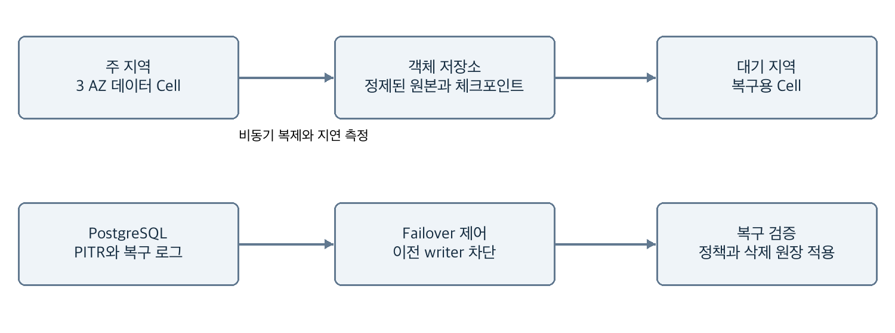

# D04 보안 운영과 상용화

> Montracer 개발 문서 세트 v2.0 (기준일 2026-10-03) · 원본: [`original/D04_Montracer_보안_운영과_상용화.docx`](original/D04_Montracer_보안_운영과_상용화.docx)  
> 이 파일은 `scripts/docs/convert_specs.py`로 생성한 파생본이다. 내용 변경은 원본 개정 + ADR로 한다.

SRE와 보안 및 사업 운영 담당자가 유료 production을 준비하는 문서다. 격리, 보존과 삭제, 복구, 용량과 원가, 청구 원장, 배포 및 지원 책임을 함께 정의한다.

### 사용 기준

제품 요구 F01~F27과 출시 범위는 D01을 기준으로 한다. 본 문서의 성능·보존·용량 수치는 구현 목표 또는 명시한 가정이며 실제 출시에는 D06 시험 증거와 승인 절차가 필요하다.

| **문서** | **읽는 목적**            |
|----------|--------------------------|
| D01      | 제품 요구사항과 벤치마크 |
| D02      | 시스템 데이터와 API 설계 |
| D03      | 계측과 고급 진단 설계    |
| D04      | 보안 운영과 상용화       |
| D05      | UX UI 디자인 명세        |
| D06      | 개발 실행과 품질 계획    |

### 참조 방법

D 번호는 문서, 절 번호는 각 문서의 목차 항목이다. B01~B16의 공개 벤치마크 원문은 D01 마지막 절, R1~R11의 표준과 엔진 근거는 D02 마지막 절에서 확인한다. 사용자·API·스키마·운영의 정의가 다르면 권위 문서를 수정한 뒤 계약 테스트를 갱신한다.

### 문서 상태

상용 구현과 인수 기준을 제안하는 설계 버전이다. 기능 완료, 보안 인증, 지원 계약 또는 확정 견적을 대신하지 않는다. 범위와 수치 변경은 revision 및 ADR로 기록한다.

## 목차

절 제목을 선택하면 해당 설계로 이동한다. 

[01 멀티테넌시와 RBAC](#01-멀티테넌시와-rbac)

[02 인증과 보안 위협 모델](#02-인증과-보안-위협-모델)

[03 개인정보와 PII 제거](#03-개인정보와-pii-제거)

[04 보존과 삭제 워크플로](#04-보존과-삭제-워크플로)

[05 고가용성과 재해 복구](#05-고가용성과-재해-복구)

[06 용량 산정 모델](#06-용량-산정-모델)

[07 확장 계획과 병목 제어](#07-확장-계획과-병목-제어)

[08 비용 모델과 가격 정책](#08-비용-모델과-가격-정책)

[09 배포와 운영 기준](#09-배포와-운영-기준)

[10 플랫폼 자체 관측](#10-플랫폼-자체-관측)

[11 장애 대응 Runbook](#11-장애-대응-runbook)

[12 상용 인증과 고객 관리](#12-상용-인증과-고객-관리)

[13 사용량 원장과 청구 계약](#13-사용량-원장과-청구-계약)

[14 확장 신호 용량과 비용](#14-확장-신호-용량과-비용)

[15 사설망 배포와 고객 지원](#15-사설망-배포와-고객-지원)

## 01 멀티테넌시와 RBAC

### 권한 모델

권한은 membership의 role, resource의 tenant·team·environment scope, 작업 action을 평가한다. deny가 allow보다 우선한다. 조직 관리자만 scope를 넓힐 수 있고 API key는 발급자의 권한보다 강해질 수 없다. MVP는 조직 단위 role, GA는 team/environment 제한을 추가한다.

| **역할** | **조회** | **변경** | **보안 관리** |
|----|----|----|----|
| Viewer | 허용된 telemetry·dashboard | 개인 saved search | 없음 |
| Developer | Viewer 범위 | dashboard·monitor 생성과 편집 | 없음 |
| Operator | Developer 범위 | silence, 수집 정책 제안, 배포 이벤트 | 범위 내 운영 감사 |
| Tenant Admin | 조직 전체 | 정책·멤버·키·삭제 job | step-up 후 권한과 삭제 |
| Security Auditor | audit와 정책 metadata | 없음 | telemetry 본문은 별도 허용 |

### 격리 계층

API middleware가 principal을 생성하고 query compiler에 필수 tenant context를 전달한다. PostgreSQL은 RLS와 composite FK를 사용한다. ClickHouse는 사용자 직접 접속을 금지하며 DB 계정·row policy 또는 dedicated DB를 방어 계층으로 추가한다. object path는 region/tenant/signal/date이며 서버가 생성한다.

Kafka ACL은 서비스 역할별 topic 접근으로 제한한다. 개별 고객 Kafka 접근은 제공하지 않는다. cache, stream, export, DLQ, audit, metrics exemplar에도 tenant를 포함한다. shared Cell의 quota는 noisy neighbor를 제어하되 강한 계산 자원 격리가 필요한 고객은 dedicated Cell로 분리한다.

### 관리 접근과 감사를 위한 검증

운영자 cross-tenant 지원은 기본 금지다. break-glass는 사유·승인자·만료 30분·작업 scope가 필요하며 모든 조회도 감사한다. 고객에게 지원 접근 이력을 제공한다. service account에는 사람의 관리자 role을 사용하지 않는다.

필수 테스트는 tenant A의 ID·cursor·dashboard·export URL을 tenant B가 재사용하는 공격, cache key 충돌, 쿼리 AST 변조, stream 재연결, 삭제 job selector 변조다. 응답 body뿐 아니라 timing, 오류 메시지, service autocomplete에 다른 조직의 존재가 누출되지 않는지 확인한다.

## 02 인증과 보안 위협 모델

### 인증 흐름

사람은 OIDC Authorization Code와 PKCE를 사용한다. state와 nonce를 검증하고 redirect URI는 고정 allowlist로 제한한다. 세션 cookie는 Secure·HttpOnly·SameSite=Lax를 기본으로 하며 mutation에는 CSRF token을 요구한다. idle 30분, 최대 12시간 후 재인증한다. 관리자 key 발급과 데이터 삭제는 MFA step-up 대상이다.

ingest key는 256-bit 이상 무작위 secret으로 생성하고 key_id prefix로 조회한 후 keyed hash를 constant-time 비교한다. 원문은 생성 응답에서만 제공한다. key는 tenant·environment·signal scope, 만료, revoke_at을 가진다. 교체는 최대 24시간 두 key의 유효기간을 겹치고 사용량 확인 후 이전 key를 폐기한다.

### 주요 위협과 대응

| **위협** | **방어** | **검증** |
|----|----|----|
| tenant 위조와 IDOR | 인증 기반 tenant, RLS, query 필수 predicate | 교차 조직 negative test |
| ingest 남용과 gzip bomb | 전후 byte 제한, CPU timeout, quota | 압축 폭탄·긴 속성 fuzz |
| log 기반 XSS | UI escaping, CSP, text-only 렌더 | HTML·script payload 회귀 |
| webhook SSRF | egress proxy, IP 검증, DNS 재검증 | private IPv4·IPv6·redirect |
| SQL injection | AST allowlist, binding, query budget | 타입·연산자 변조 |
| 공급망 침해 | digest pin, SBOM, 서명, 취약점 gate | unsigned image 배포 차단 |

### 네트워크와 키 관리

인터넷에서 ingress와 UI/API만 접근 가능하게 하고 DB·Kafka는 private network에 둔다. service-to-service mTLS 또는 동등한 workload identity를 사용한다. TLS 1.2 이상, 가능한 1.3을 사용하고 인증서 만료 30·14·7일 전 경보를 둔다. 저장 암호화 키는 KMS로 관리하며 서비스 role별 decrypt scope를 분리한다.

secret은 Git·환경 dump·crash report에 기록하지 않는다. secret manager에서 short-lived credential을 발급하고 운영 접근은 SSO와 감사 가능한 bastion 또는 session manager를 사용한다. 취약점 대응 목표는 악용 확인 critical 24시간 완화, high 7일 해결로 제안하고 출시 전 보안팀과 확정한다.

tenant 폐쇄 시 신규 token 발급, active session, ingest key, stream, export URL을 모두 무효화한다. 인증 cache의 폐기 전파 목표는 60초이며 제어 평면 단절 시 해당 한도 뒤 fail closed한다.

## 03 개인정보와 PII 제거

### 최소 수집 원칙

HTTP header는 기본 deny이며 content-type 등 필요한 항목만 allowlist한다. authorization, cookie, set-cookie, password, token, secret, 개인식별번호는 수집하지 않는다. URL query string은 기본 제거하고 path는 /users/{id} 형태 route template을 우선 사용한다. DB statement는 parameterized query 형태만 수집한다.

log body는 구조화 JSON의 허용 key를 우선 보관한다. 이메일·전화번호 등 패턴 redaction은 보완 수단이며 탐지 누락을 전제로 한다. 주민번호 등 민감 식별자는 수집 금지를 기본 정책으로 둔다. 고객이 본문 수집을 켜면 데이터 분류·보존·권한을 함께 지정하도록 한다.

### 처리 순서와 버전

SDK 또는 agent에서 1차 제거하고 서버 ingress에서 2차 강제 적용한다. Kafka·DLQ·object archive·live stream·오류 log로 쓰기 전에 실행한다. redaction processor 실패 시 해당 record를 저장하지 않고 영구 거절 건수를 보고한다. 장애 원인 분석을 위해 원본을 몰래 별도 보관하지 않는다. \[R11\]

정책은 key allowlist, denylist, 값 길이 제한, pattern replacements, optional HMAC tokenization과 policy_version으로 구성한다. HMAC은 tenant별 key와 salt version을 사용하되 익명화로 간주하지 않는다. 연결 가능한 가명 데이터이므로 접근과 삭제 정책을 유지한다.

| **데이터**  | **기본 처리**              | **예외 승인**               |
|-------------|----------------------------|-----------------------------|
| 인증 정보   | 필드 삭제                  | 허용하지 않음               |
| 고객 식별자 | 미수집 또는 tenant HMAC    | 목적·보존·접근 scope 필요   |
| IP 주소     | 제거 또는 축약             | 보안 분석 제품은 별도 설계  |
| 에러 stack  | 경로·인자에서 secret scrub | 본문 열람 권한 분리         |
| SQL와 URL   | template 및 query 제거     | 테스트 조직의 제한된 진단만 |

### 검증과 운영 책임

보안 fixture에는 가짜 secret·다국어 이름·encoded URL·중첩 JSON·multipart·긴 문자열을 포함한다. ingress 이후 모든 저장소와 platform 자체 log에서 fixture가 검색되지 않아야 한다. 매 release와 정책 변경에서 회귀 시험을 실행한다.

데이터 거주 지역과 하위 처리자는 계약에 기록한다. 실제 개인정보 법적 근거·국외 이전·보존 의무는 출시 대상과 계약이 정해진 뒤 법무 검토로 확정한다. 본 문서의 삭제 시간은 제품 목표이며 특정 법률 준수 인증이나 법정 기한을 대신하지 않는다.

## 04 보존과 삭제 워크플로

### 기본 보존 정책

| **저장 계층** | **기본 보존** | **삭제 방식** |
|----|----|----|
| trace와 log hot | 7일 | query expires_at 필터와 TTL, 예외 mutation |
| metric 원본 | 15일 | event-time TTL |
| metric rollup | 1분 90일, 1시간 395일 | 계층별 TTL과 삭제 job |
| Kafka와 quarantine | 24시간 | retention, 삭제 원장 적용 후 replay |
| 선택적 정제 archive | 30일 | tenant/date object 재작성·lifecycle |
| 운영 백업 | 35일 | 만료, restore 시 삭제 원장 재적용 |
| 보안 audit | 365일 제안 | 본문 PII 배제, 계약별 별도 정책 |

### 삭제 상태와 SLA

조직 폐쇄·특정 service/time 삭제는 POST /deletion-jobs로 시작한다. 관리자의 step-up, selector preview count, 승인 audit를 남긴다. requested에서 tombstone과 policy epoch를 commit하고 15분 이내 query·cache·stream·export 접근을 차단한다. 물리 삭제 목표는 live store 24시간, Kafka 및 임시 큐 24시간, 백업 만료 35일 이내다.

worker는 원본, trace summary, metric rollup, map, object archive, export, quarantine를 대상으로 삭제 계획을 만든다. ClickHouse mutation 완료와 replica 상태를 확인하고 삭제 selector로 재조회한다. TTL merge가 끝나지 않았는데 completed로 표시하지 않는다. Kafka는 record 단위 즉시 삭제가 어려워 논리 차단과 짧은 retention을 병행한다.

### 재유입과 복구 차단

삭제 원장은 telemetry 백업과 별도 복제하고 원본 복구보다 먼저 적용한다. 수집 키를 revoke하고 해당 selector의 replay를 차단한다. 정상 새 데이터와 삭제된 과거 데이터를 구분하도록 tenant lifecycle epoch와 time range를 포함한다. tombstone은 가장 오래된 백업 만료와 최대 replay 기간보다 오래 보관한다.

백업에서 즉시 물리 삭제가 불가능한 한계를 계약에 명시한다. restore된 cluster는 외부 접근을 막은 상태에서 삭제 원장을 적용하고 검증한 뒤 활성화한다. tenant별 암호화 key 폐기는 tenant별 ciphertext 경계가 실제로 분리된 경우에만 보완 수단으로 사용한다.

사용자 한 명의 데이터를 telemetry에서 찾는 기능은 기본 제공하지 않는다. 개인 식별자를 아예 수집하지 않거나 명시적 가명 subject key index를 설계한 고객만 지원한다. 완결성을 검증할 수 없으면 임의 문자열 검색 결과만으로 전체 삭제 완료를 선언하지 않는다.

## 05 고가용성과 재해 복구

*그림 2 지역 복구와 이전 writer 차단*

### 장애 영역별 설계

stateless ingress·query·worker는 3 AZ에 분산한다. Kafka는 broker 3개 이상, RF=3와 min ISR=2를 적용한다. ClickHouse shard는 최소 2 AZ의 2 replicas와 3-node Keeper를 사용한다. PostgreSQL은 동기 standby를 포함한 HA 구성으로 운영한다. 한 AZ 장애 때 필요한 잔여 처리량을 평상시 60% 이하 사용률로 확보한다.

| **장애** | **RPO 목표** | **RTO 목표** |
|----|----|----|
| pod와 단일 node | 승인된 Kafka 데이터 0 | 5분 |
| 단일 AZ | 승인 데이터 0, quorum 유지 조건 | 15분 |
| 지역 전체 | telemetry 15분, control 5분 | telemetry 4시간, control 1시간 |

RPO 0은 복제 quorum이 정상인 단일 장애 가정이다. 지역 동시 손실, 데이터 corruption, 고객 SDK drop까지 포함하지 않는다. 지역 DR은 Scale 단계에서 승인된 동일 데이터 거주 권역의 대기 지역에 구현한다. 그 이전에는 offsite backup 복구 수준을 별도로 공지한다.

### 복구 절차와 증거

운영자는 사고 지역 write endpoint를 fence하고 routing epoch를 증가시킨다. 대기 지역의 PostgreSQL PITR을 복구한 뒤 tenant 상태·키 폐기·삭제 원장을 먼저 적용한다. 정제 archive와 체크포인트로 telemetry를 재생하고 시간 구간별 record 수·checksum·synthetic trace를 확인한다.

미복구 구간은 UI에 표시하고 DNS·routing을 바꾼다. 이전 지역이 돌아와도 자동 writer 승격하지 않는다. split brain을 막는 lease와 수동 승인 절차를 사용한다. 비동기 복제 지연이 RPO를 넘으면 DR 준비 상태를 degraded로 경보한다. 분기마다 격리 환경에서 전체 복구 시간을 재측정한다.

## 06 용량 산정 모델

### 계산 전제

아래는 압축 전 span 800B, log 400B, metric point 32B와 metric 15초 주기를 가정한 예산 모델이다. metric byte는 label 사전 분리 후 amortized 값이며 histogram과 고 cardinality에서는 훨씬 커질 수 있다. GB는 10^9 bytes, TB는 1,000GB다. 초기 측정 전 이 값을 제품 처리량 보장으로 사용하지 않는다.

생성 trace는 10k spans/s이며 tail 도입 시 head 100%를 수용할 수 있도록 계산한다. 저장 trace 비율은 10%, trace 압축 4:1, log 5:1, metric 2:1이다. head 10% MVP에서는 실제 ingress trace량이 낮지만 이후 tail 전환 때 ingress가 10배 늘어나는 점을 예산에 반영한다.

| **신호** | **일일 원본 GB** | **일일 저장 GB** |
|----|----|----|
| trace | 10,000 × 86,400 × 800 / 10^9 = 691.20 | 691.20 × 10% / 4 = 17.28 |
| log | 5,000 × 86,400 × 400 / 10^9 = 172.80 | 172.80 / 5 = 34.56 |
| metric | 100,000 / 15 × 86,400 × 32 / 10^9 = 18.43 | 18.43 / 2 = 9.22 |

### Hot와 Rollup 디스크

원본 논리 저장은 17.28×7 + 34.56×7 + 9.216×15 = 501.12GB다. 1분 rollup은 point당 압축 후 24B를 가정하여 100k×1,440×24×90 / 10^9 = 311.04GB다. 1시간 rollup 395일은 22.752GB다. 합계 논리 저장은 834.912GB다.

2 replicas, index·merge 추가 30%, 최대 disk 사용률 70%를 적용하면 provisioned disk = 834.912×2×1.3/0.7 = 3,101.1GB, 약 3.10TB다. TTL 삭제 지연과 대형 mutation 공간이 추가로 필요하면 별도 여유를 더한다. rollup에 포함되는 실제 활성 series 수와 histogram byte는 부하 시험에서 대체한다.

### Kafka와 대역폭

pre-sampling 총 입력은 882.432GB/day다. Kafka 압축 2:1, retention 1일, RF 3, 부가 공간 30%, 70% 사용 상한이면 2,458.2GB다. 평균 wire는 약 5.11MB/s, 3배 피크 15.32MB/s이며 broker 복제와 sink 트래픽은 별도다. head 10%로만 운영하면 이보다 감소한다.

확장 기준은 위 생성량·series·log가 모두 10배이므로 raw+rollup 디스크 약 31.01TB, Kafka 24.58TB가 출발점이다. 압축률, trace 저장률, series churn이 선형 비례를 깨뜨리므로 이 값을 scale-out 설계의 초기치로만 사용한다.

## 07 확장 계획과 병목 제어

### 처리량 기반 증설

CPU 기준만으로 autoscale하지 않는다. ingress는 accepted bytes/s와 queue wait, worker는 partition lag seconds와 처리 throughput, query는 대기 시간과 scan byte를 사용한다. scale-down은 tail decision window와 checkpoint drain 이후에만 허용한다. 단일 partition 쏠림은 replica 수 증가만으로 해결되지 않는다.

초기 Kafka topic은 traces 24, logs 12, metrics 12 partitions로 시작하고 성능 시험으로 조정한다. tail trace의 partition 추가는 routing epoch·in-flight trace 이동을 수반한다. 매일 자동 repartition하지 않는다. Kafka partition 수는 worker 병렬성 상한이며 hot tenant는 salted trace key 대신 별도 Cell 또는 tenant quota로 제어한다.

| **병목** | **탐지 지표** | **대응** |
|----|----|----|
| Collector | refused·queue·heap | batch 조정, 메모리 제한, 수평 증설 |
| Kafka | produce latency, ISR, lag | broker IO·network 증설, 보존 용량 확보 |
| Sampler | active traces, eviction, oldest age | partition 증설 계획, 정책·예산 조정 |
| ClickHouse | parts, merge backlog, query scan | batch 크기 조정, shard·replica 분리 |
| PostgreSQL | lock wait, connection, replication lag | pool 상한, 쿼리 최적화, HA 조정 |

### Batch와 데이터 배치

ClickHouse insert는 5,000~50,000 records 또는 최대 1초로 묶어 작은 part 폭증을 피한다. 저량 tenant는 다른 tenant와 같은 batch에 포함하되 각 row의 tenant를 유지한다. routing은 tenant와 trace_id/stream_id의 hash로 분배해 hot tenant가 특정 shard를 독점하지 않게 한다.

read replica를 늘려도 write shard 용량이 늘지는 않는다. shard 추가 시 과거 data를 옮길지 기간별 router를 쓸지 ADR로 결정한다. 70% disk, 60% 지속 CPU, lag 5분 중 하나가 30분 유지되면 증설 검토를 열고, 85% disk 또는 retention 위협은 incident로 올린다.

### Cell 이동 절차

새 Cell의 quota·정책·키 cache를 먼저 준비한다. 신규 routing epoch의 입력은 새 Cell로 보내고 기존 epoch는 drain한다. 전환 시각 이전 데이터 조회는 이전 Cell, 이후는 새 Cell로 분리하며 경계 구간은 dedup merge한다. dual write는 비용과 중복 복잡성이 커 기본 사용하지 않는다. rollback은 기록된 epoch를 기준으로 결정한다.

## 08 비용 모델과 가격 정책

### Core 인프라의 가상 계획 예시

다음 단가는 공급자 견적이 아닌 계산용 가정이며 USD, 30일 기준이다. 실제 지역·인스턴스·IOPS·계약 할인·세금은 procurement에서 교체한다. D04 06절의 head 100% 준비 용량과 10% trace 저장률, 2 replicas를 그대로 사용한다.

| **항목**                 | **가정**                    | **월 비용 USD** |
|--------------------------|-----------------------------|-----------------|
| Ingress와 worker compute | 4개 × 80                    | 320             |
| Kafka compute            | 3개 × 120                   | 360             |
| ClickHouse compute       | 2개 × 240                   | 480             |
| ClickHouse disk          | 3.1011TB × 100/TB           | 310             |
| Kafka disk               | 2.4582TB × 100/TB           | 246             |
| Control DB와 보조 서비스 | HA·Keeper 등 계획 allowance | 300             |
| Object와 backup          | 2TB × 25/TB                 | 50              |
| LB·egress·운영 관측      | 월 계획 allowance           | 250             |
| 인프라 합계              | 반올림                      | 2,316           |
| 예비비 25% 포함          | 2,316 × 1.25                | 2,895           |

인건비, 지원, 관리형 premium, 지역 DR, 장기 pre-sampling archive는 별도다. 30일 archive를 켜면 하루 약 61.06GB의 post-sampling 압축 데이터만으로도 1.83TB이며 backup 2TB allowance가 부족할 수 있다. full ingress archive는 약 13.24TB/30일로 증가하므로 별도 항목으로 계산한다.

### 민감도와 단위 경제성

월 비용 = compute + hot disk + queue disk + object + request/IO + cross-AZ + internet egress + 운영 인건비다. trace 저장 비율을 10%→100%로 올리면 trace hot 논리 저장만 120.96→1,209.6GB로 증가한다. head sampling을 줄이면 서버 ingress 비용까지 감소하지만 오류 보존율은 낮아진다.

log량 2배는 log storage와 처리량을 약 2배로 늘린다. metric 활성 series 4배는 raw·rollup과 state 비용을 모두 늘린다. 비용 검토는 ingest GB, retained GB-day, query scanned GB, active series-hour를 조직별로 보여주며 숨은 고 cardinality를 먼저 찾는다.

### 과금 설계

MVP는 사용량 표시와 soft quota만 제공한다. 유료 과금 전에는 billable event 정의, 재전송 중복 credit, late usage 정산, UTC 일 경계와 월 마감 정책을 고정한다. 네트워크 수신 byte와 canonical accepted byte를 분리하며 원문 중복을 자동으로 이중 청구하지 않는다. 일별 usage ledger를 불변 event로 저장하고 고객 합계와 원장 합계를 대조한다.

## 09 배포와 운영 기준

### 환경과 설정

dev·staging·production 계정과 key를 분리하고 production 데이터가 개발 환경으로 복제되지 않게 한다. IaC는 network, KMS, object, Kafka, DB, cluster를 관리하고 Helm은 서비스와 policy를 배포한다. secret 값은 Git에 저장하지 않고 참조만 넣는다. feature flag와 schema version을 release manifest에 기록한다.

Production은 resource request/limit, topology spread, PodDisruptionBudget, readiness·liveness·startup probe를 명시한다. readiness는 요청 수용 가능 여부이며 외부 모든 dependency 상태를 liveness에 연결해 재시작 폭주를 만들지 않는다. termination에는 신규 요청 차단, in-flight drain, offset checkpoint 순서를 따른다.

### 운영 반복 업무

| **주기** | **점검**                                     | **책임**       |
|----------|----------------------------------------------|----------------|
| 매일     | SLO burn, pipeline lag, disk·quota, key 이상 | 당직 SRE       |
| 매주     | cardinality 상위 항목, 느린 query, DLQ       | Data Platform  |
| 매월     | 비용 예측, IAM 검토, patch·restore 부분 시험 | SRE와 Security |
| 분기     | 지역 DR, key rotation, 삭제·권한 침투 시험   | SRE와 Security |

### 업그레이드와 변경 관리

DB schema는 expand → dual-compatible read/write → backfill → contract 순서로 변경한다. 한 번에 API와 저장 schema를 파괴적으로 바꾸지 않는다. backfill은 query와 ingest 용량을 침범하지 않도록 20% 예산으로 제한한다. 장기간 migration은 상태·진행률·취소와 재시작 지점을 기록한다.

stateless는 5% canary 30분 후 25%·100%로 확대한다. 수집 거절률, p99 latency, lag, memory와 synthetic trace 유실을 baseline과 비교한다. sampler는 state schema 호환과 partition drain이 선행되어야 한다. downgrade가 불가능한 data migration은 코드 rollback과 분리해 복구 경로를 문서화한다.

Helm rollback만으로 외부 DB·Kafka 설정이 복원된다고 가정하지 않는다. rollout 전 현재 manifest, 정책 epoch, schema revision, DB backup checkpoint를 기록한다. 장애 때 적용할 직전 안정 version은 registry에서 digest로 즉시 가져올 수 있어야 한다.

## 10 플랫폼 자체 관측

### 고객 경로와 독립된 관측

APM 자신의 장애를 같은 APM만으로 감지하면 수집 중단과 함께 경보도 사라진다. 운영용 Prometheus와 외부 heartbeat를 별도 실패 영역에 두고 핵심 alert를 독립 알림 경로로 전달한다. platform trace는 별도 tenant·낮은 sampling으로 수집하며 재귀 instrumentation은 차단한다.

| **단계** | **필수 지표** | **초기 경보 조건** |
|----|----|----|
| SDK와 agent | export_fail, queue_fill, dropped | drop 증가 또는 queue \>80% 5분 |
| Ingress | accepted/rejected, auth_fail, latency | 내부 5xx \>0.5% 5분 |
| Kafka | oldest_age, lag, ISR, disk | lag \>5분 또는 ISR 저하 |
| Worker | processed, duplicate, redacted, quarantine | 처리율이 입력보다 낮음 10분 |
| Store | insert latency, part count, replication lag | merge backlog 증가와 disk \>80% |
| Query와 alert | timeout, partial, eval lag, delivery fail | synthetic 평가 실패 2회 |

### 데이터 회계와 Synthetic

각 stage는 tenant·signal·time bucket별 건수를 기록한다. durable_accepted_attempts = unique_accepted + duplicates이며 unique_accepted = persisted_kept + policy_drop + in_flight + terminal_failure다. 영구 거절은 승인 이전으로 분리하고 동일 cohort의 window가 닫힌 뒤 비교한다. retry로 중간 count가 중복될 수 있으므로 event ID 또는 batch checkpoint 기준으로 정규화한다. raw accepted와 sampling 이후 저장을 직접 비교해 손실로 오판하지 않는다.

1분마다 알려진 trace_id의 3-span trace와 연결 log·metric exemplar를 전송한다. 60초 내 조회·연결·정책 적용을 검증한다. 매 5분 synthetic monitor를 발생시켜 실제 알림 callback까지 확인하며 시험 알림은 고객 채널로 보내지 않는다.

### 운영 Dashboard

첫 화면은 수집 성공, 신선도, 검색 성공, alert 발송과 남은 오류 예산을 보여준다. 다음 화면은 Cell별 비용·용량·lag, 조직별 quota 거절과 cardinality를 제공한다. telemetry body·user_id를 platform metric label에 포함하지 않는다.

platform log에는 request_id, tenant의 내부 ID, code, stage, duration과 byte만 기록한다. key·raw filter literal·PII body는 금지한다. 운영 metric의 tenant label도 고객 수 증가에 따라 bounded top-N 또는 별도 usage 저장소로 옮긴다. 모니터링 비용 역시 D04 08절의 비용 원장에 포함한다.

## 11 장애 대응 Runbook

### 공통 대응 체계

SEV1은 cross-tenant 노출, 승인 데이터 대량 유실, 전체 Cell 수집 중단이다. SEV2는 일부 고객 freshness·query SLO 위반, SEV3는 우회 가능한 기능 저하다. SEV1 감지 후 5분 내 incident commander와 technical lead를 지정하고 15분마다 영향·완화·다음 시각을 업데이트한다. 보안 노출은 보안 담당자를 즉시 포함한다.

### RB01 Kafka 적체와 저장 장애

탐지: oldest lag \>5분 또는 Kafka disk \>80%가 5분 지속한다. 영향 tenant·signal과 retention 잔여 시간을 계산한다. 첫 10분에 broker ISR, worker 오류, ClickHouse insert·merge·disk 상태를 확인한다. query/export/backfill을 먼저 감속하고 정상 replica와 worker를 복구한다.

producer가 quorum에 쓰지 못하면 ingress는 ACK하지 않고 503을 반환한다. 소비 offset을 임의로 앞으로 옮기거나 queue를 삭제하지 않는다. 용량이 부족하면 broker/storage를 증설하고 tenant quota 정책의 비필수 입력 제한을 적용한다. 검증은 lag 1분 이하, 3회 연속 synthetic 성공과 stage 회계 일치다. retention 초과 구간은 유실 범위를 기록한다.

### RB02 검색 지연과 Cardinality 폭증

탐지: query p95 \>2초 10분 또는 memory kill 발생. 조직·query ID별 scan과 새 series 상위 metric을 확인한다. 문제 query를 취소하고 interactive 동시성을 낮추며 export를 일시 중지한다. 신규 series를 quota로 차단하되 기존 series는 유지한다. 무작정 모든 DB replica를 재시작하지 않는다.

최근 release와 index·partition 변화를 확인한다. 필요 시 query service만 이전 digest로 되돌린다. 검증은 15분 동안 p95와 queue 정상, 피해 없는 tenant의 성공률 유지다. 잘못 합쳐진 series는 자동 label 삭제로 보정하지 않고 원본 재계산 job으로 복구한다.

### RB03 개인정보 유출과 권한 침해

의심 tenant·키·policy version을 확인하고 해당 ingest key와 접근을 차단한다. 잘못된 policy를 이전 검증본으로 되돌리고 stream·cache·export를 무효화한다. 민감 payload를 티켓·채팅에 복사하지 않는다. 접근 audit와 비민감 metadata를 제한 저장소에 보전한다.

삭제 job으로 원본·집계·archive·queue·backup 영향을 추적한다. 보안 담당자가 고객 통지 대상과 시점을 결정한다. 검증은 fixture 검색 불가, 교차 조직 negative test 통과와 삭제 proof 완료다. 단순 key 교체만으로 사건을 종료하지 않는다.

### RB04 알림 누락과 지역 장애

monitor 평가 실패와 notification delivery 실패를 분리한다. outbox 미전송을 event_id 기준으로 replay하고 중복 가능성을 표시한다. 외부 provider 실패 시 승인된 fallback 채널을 사용한다. 지역 전체 장애는 D04 05절의 fence·restore·삭제 원장·synthetic 검증 순서를 따른다.

복구 후 2영업일 내 타임라인·탐지 공백·영향 건수·재발 방지 owner와 기한을 기록한다. 오류 예산이 소진된 Cell은 기능 release를 중지하고 신뢰성 개선을 우선한다.

## 12 상용 인증과 고객 관리

### Enterprise identity

G1은 OIDC와 기업 SAML federation, SCIM user/group provisioning을 제공한다. 검증된 IdP 또는 identity broker를 우선 사용하며 SAML XML parser를 새로 구현하지 않는다. issuer·audience·destination·signature·clock tolerance와 replay ID를 검증한다. JIT 가입만으로 관리자 role을 부여하지 않는다.

SCIM externalId는 조직 내 고유하며 group→role mapping은 admin이 명시한다. deprovision은 active session·API token·SSE·export를 60초 이내 차단한다. SCIM 재시도는 idempotent이며 group 삭제가 다른 tenant group에 영향을 주지 않는다. IdP 장애용 break-glass 계정은 최소 2개, 별도 MFA와 사용 감사, 정기 복구 훈련을 둔다.

### 기능별 권한

| **권한** | **허용 대상** | **추가 제약** |
|----|----|----|
| telemetry.read | 지정 team과 environment | 필드 deny 정책과 tombstone 적용 |
| diagnostics.execute | Operator 별도 부여 | production 승인자 분리와 MFA |
| diagnostics.read | 허용 agent 결과 | 결과 24시간, 조회 감사 |
| profiles.read와 dbm.read | 별도 signal scope | source code·SQL parameter 권한 아님 |
| replay.read | 승인 app | 별도 목적·열람 audit |
| billing.read와 billing.manage | 재무·관리자 | telemetry 원문 권한 아님 |
| integrations.manage | 지정 connector | secret 원문 재조회 금지 |

### 고객 lifecycle

trial → active → past_due → restricted → suspended → closing → deleted로 관리한다. past_due는 grace 기간과 통지 후 mutation 제한으로 진행하되 기존 데이터 조회·export·삭제 요청은 별도 정책으로 보호한다. 사용량 한도나 결제 실패를 이유로 데이터 삭제를 즉시 시작하지 않는다.

entitlement에는 plan_version, enabled_features, quotas, retention_limits, support_tier, region과 유효기간을 둔다. UI 메뉴 숨김은 보안 수단이 아니며 API와 worker에서도 entitlement를 확인한다. 기능 활성화는 개인정보·보존·가격 영향 확인 후 audit를 남긴다.

## 13 사용량 원장과 청구 계약

### 과금 단위 제안

첫 상용안은 플랫폼 기본료와 신호별 사용량을 분리한다. 수집 span bytes, indexed log bytes, 활성 metric series-hours, profile host-hours, RUM sessions, Synthetic runs를 후보로 하며 plan_version으로 고정한다. 경쟁사 가격표를 복사하거나 아직 측정하지 않은 원가로 확정 요금을 제시하지 않는다.

| **단위** | **산식과 계측 지점** | **제외와 정정** |
|----|----|----|
| trace ingest GB | scrub 후 canonical payload bytes / 10^9 | header·retry duplicate 제외 |
| log indexed GB | 검색 가능 kept 원본의 logical bytes | 정책 drop·실패 미저장 제외 |
| metric series-hour | 시간 bucket 내 활성 stream 고유 수 합 | 정의와 label 정책 변경 별도 표시 |
| profile host-hour | 허용 instance의 profile 제공 시간 | 같은 instance retry 중복 제외 |
| RUM session | 동일 app/session의 고유 승인 세션 | bot 차단·거절 제외 |
| synthetic run | 시작한 test slot와 location의 run | 플랫폼 실패와 내부 retry 제외 |

### 원장 스키마와 대사

usage_entry는 tenant, product, meter_version, interval_start, interval_end, source_event_id, quantity, unit, plan_version, revision, adjustment_of를 갖는다. source_event_id+meter_version은 고유다. 원장은 append-only이며 수정은 음수·양수 정정 항목으로 남긴다. 고객에게 일별 사용량과 잠정·확정 상태를 제공한다.

day close는 T+2일, invoice preview는 월말 후 3일을 시작 정책으로 제안한다. 수집 회계·저장 회계·원장을 자동 대조하고 허용 오차를 넘으면 자동 청구를 보류한다. SDK log event_id가 없어 중복 구별이 불가능한 입력은 요금 정책에서 한계를 설명하고 platform replay는 안정 envelope ID로 반드시 제외한다.

### 예산과 실패

예산 80%·100% 알림, soft cap과 explicit hard cap을 별도로 설정한다. hard cap 변경은 어떤 신호가 drop되는지 preview와 audit를 요구한다. billing 장애로 ingest를 멈추지 않으며 usage event는 독립 durable topic으로 보존한다. 미계측 구간은 추정이라고 표시하고 고객에게 유리한 보정 정책을 계약에 명시한다.

## 14 확장 신호 용량과 비용

### 기본 모델에 추가할 부하

D04 기본 비용표는 trace·log·metric 소규모 Core의 가상 계획이다. 아래 별도 가정의 신호는 그 표에 포함되지 않는다. 압축률·사용량은 실측으로 대체하고 storage, request, egress, compute, 지원 인건비를 각각 계산한다.

| **워크로드 가정** | **일일 계산** | **7일 logical payload** |
|----|----|----|
| Profile 100 instances | 100 × 0.25MB/min × 1,440 = 36GB | 252GB |
| RUM 1M events/day | 1M × 0.8KB = 0.8GB | 5.6GB |
| Replay 10k sessions/day | 10k × 2MB = 20GB | 140GB |
| Browser test 100개 5분 주기 | 100 × 288 = 28,800 runs/day | artifact 0.2MB/run이면 40.32GB |
| DBM 100 instances | 100 × 100 digests × 5,760 × 80B = 4.608GB | 32.256GB |

단위는 decimal이다. 위 일일 GB는 예시의 전송 또는 압축 payload 가정이며 replication·metadata·index·object API 요금은 별도다. profile과 replay는 객체 저장소에 두며 ClickHouse replica 배수를 전체 object 비용에 다시 곱하지 않는다. DBM의 100 digests는 top-N이므로 전체 DB workload coverage와 다르다.

### Runner 계산

browser test 평균 실행시간 20초이면 28,800 × 20 / 86,400 = 평균 동시 6.67개다. 목표 이용률 60%에서는 최소 12 slots, burst와 장애용 별도 여유를 둔다. slot당 1vCPU·1GiB는 초기 실험값이며 페이지 무게·영상 여부에 따라 부하 시험으로 확정한다. 실제 인프라 가격은 region별 견적으로 승인한다.

### FinOps 제어

세션당 replay byte 상한, profile symbol cache, DB digest top-N, inactive series 정리, per-tenant query scan budget을 적용한다. 원가 보고는 signal별 logical GB-day, physical GB-day, CPU hour, egress, object requests, support hours를 분리한다. 가격 인상은 미래 plan_version에만 반영하고 기존 확정 invoice를 재계산하지 않는다.

마진은 매출에서 클라우드·지원·라이선스·결제 비용을 차감해 산정한다. 월 인프라 비용만으로 gross margin 또는 전체 운영비를 주장하지 않는다. 규모 10배에서 storage는 근사 선형이지만 query·cardinality·support는 비선형이므로 세 가지 사용 패턴으로 민감도를 분석한다.

## 15 사설망 배포와 고객 지원

### 배포 에디션

SaaS shared Cell, SaaS dedicated Cell, customer-managed 세 가지 배포판을 같은 protocol·schema로 유지한다. 차이는 네트워크·KMS·운영 책임·upgrade 주체다. customer-managed는 최소 권고 용량, 지원 Kubernetes·storage class, offline registry와 서명 bundle을 배포 매뉴얼에 기록한다.

customer-managed는 사전 점검 → DB backup → expand migration → canary → rollout → verification 순이다. 두 연속 minor 사이의 upgrade만 기본 지원하고 건너뛰기는 별도 migration plan을 요구한다. license grace는 30일 제안이며 만료로 삭제 기능·기존 데이터 export를 막지 않는다.

### 지원과 incident

| **등급** | **예시** | **지원 응답 목표안** |
|----|----|----|
| SEV1 | 격리 위반·전면 수집 중단 | 24시간 당직이 확보된 계약만 15분 |
| SEV2 | 특정 Cell 지연·핵심 기능 부분 장애 | Enterprise 1시간 |
| SEV3 | 우회 가능한 UI 문제 | 영업일 1일 |

해결 시간은 상황에 따라 달라지므로 응답 목표와 구분한다. 해당 당직 인력과 훈련이 없으면 24시간 지원을 판매하지 않는다. 공개 status page는 Montracer와 다른 hosting·credential을 사용한다. 고객 통지에는 영향 region·signal·시각·데이터 손실 가능성과 다음 갱신 시각을 포함한다.

### 지원 번들과 감사

지원 번들은 version·설정 key 이름·redacted metric·request ID·health check만 기본 포함한다. key, raw log, heap, thread dump, replay는 기본 제외다. 고객 preview 후 일회성 upload와 7일 만료를 적용한다. 지원자는 승인된 목적과 기간만 접근하고 고객은 이력을 확인할 수 있다.

### 신규 기능 Runbook

RB05 agent CPU 폭증: 최근 probe·profile revision 확인 → 해당 기능 kill → 기본 tracing 유지 → 15분 overhead 정상 검증 → 재활성화 승인. 무조건 고객 process를 재시작하지 않는다.

RB06 replay PII 의심: app capture off → manifest access epoch 차단 → 제한된 metadata 증거 보전 → 삭제 job → masking fixture와 restore 검증 후 재개.

RB07 invoice 불일치: 자동 청구 hold → meter version·dedup·시간대 조사 → 원장 정정 → 고객 preview 재발급. 원장 row를 직접 수정하거나 삭제하지 않는다.

RB08 synthetic runner compromise: location token revoke → runner egress 차단 → secret rotation → 이미지와 host 교체 → 독립 재검증. 결과를 대상 서비스 장애로 집계하지 않는다.
