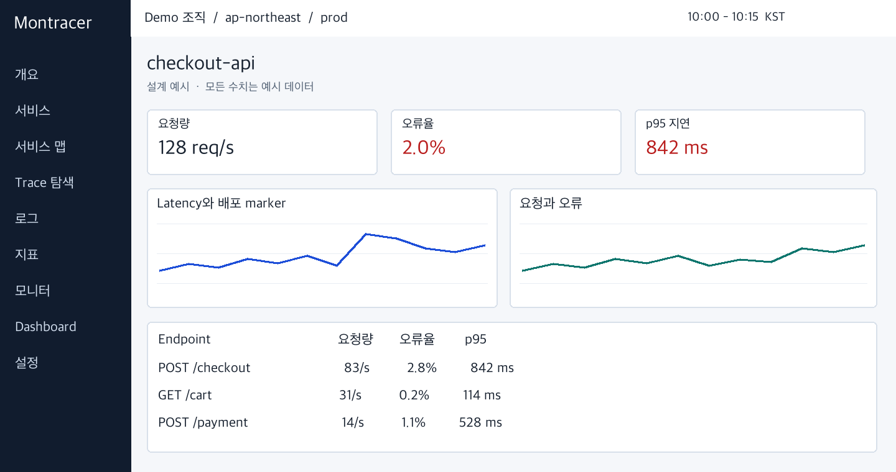
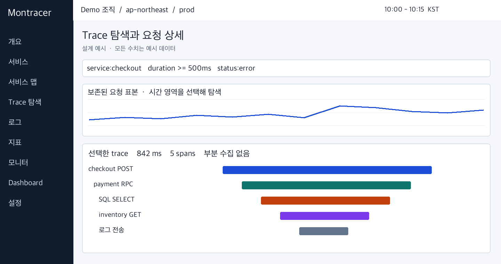
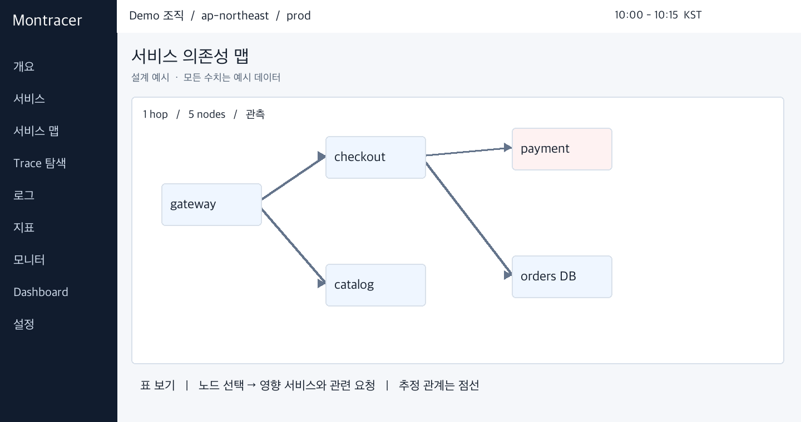
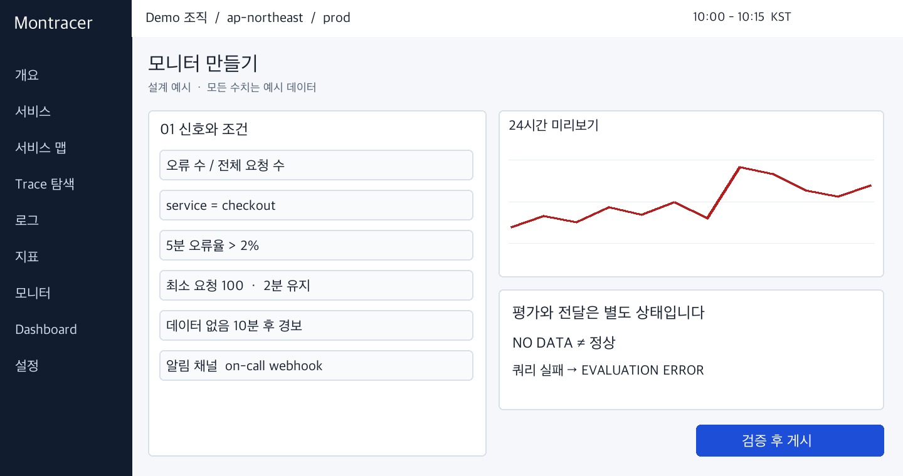
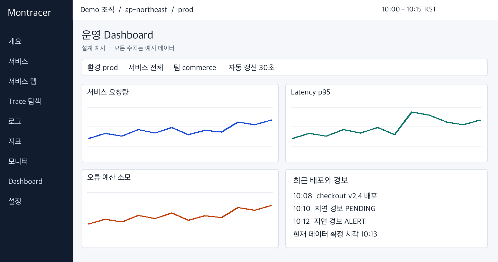

# D05 UX UI 디자인 명세

> Montracer 개발 문서 세트 v2.0 (기준일 2026-10-03) · 원본: [`original/D05_Montracer_UX_UI_디자인_명세.docx`](original/D05_Montracer_UX_UI_디자인_명세.docx)  
> 이 파일은 `scripts/docs/convert_specs.py`로 생성한 파생본이다. 내용 변경은 원본 개정 + ADR로 한다.

디자이너와 Frontend 개발자를 위한 화면과 상호작용의 구현 기준이다. 서비스 중심 탐색을 독립적인 Montracer 디자인으로 구성하며 개념 화면 5종과 상태별 인수 기준을 제공한다.

### 사용 기준

제품 요구 F01~F27과 출시 범위는 D01을 기준으로 한다. 본 문서의 성능·보존·용량 수치는 구현 목표 또는 명시한 가정이며 실제 출시에는 D06 시험 증거와 승인 절차가 필요하다.

| **문서** | **읽는 목적**            |
|----------|--------------------------|
| D01      | 제품 요구사항과 벤치마크 |
| D02      | 시스템 데이터와 API 설계 |
| D03      | 계측과 고급 진단 설계    |
| D04      | 보안 운영과 상용화       |
| D05      | UX UI 디자인 명세        |
| D06      | 개발 실행과 품질 계획    |

### 참조 방법

D 번호는 문서, 절 번호는 각 문서의 목차 항목이다. B01~B16의 공개 벤치마크 원문은 D01 마지막 절, R1~R11의 표준과 엔진 근거는 D02 마지막 절에서 확인한다. 사용자·API·스키마·운영의 정의가 다르면 권위 문서를 수정한 뒤 계약 테스트를 갱신한다.

### 문서 상태

상용 구현과 인수 기준을 제안하는 설계 버전이다. 기능 완료, 보안 인증, 지원 계약 또는 확정 견적을 대신하지 않는다. 범위와 수치 변경은 revision 및 ADR로 기록한다.

## 목차

절 제목을 선택하면 해당 설계로 이동한다. 

[01 디자인 방향과 조사 모델](#01-디자인-방향과-조사-모델)

[02 디자인 토큰과 시각 규칙](#02-디자인-토큰과-시각-규칙)

[03 컴포넌트와 상태 계약](#03-컴포넌트와-상태-계약)

[04 화면 목록과 라우트](#04-화면-목록과-라우트)

[05 서비스 상세 화면](#05-서비스-상세-화면)

[06 Trace Explorer와 상세 화면](#06-trace-explorer와-상세-화면)

[07 Service Map과 JVM Inspector](#07-service-map과-jvm-inspector)

[08 로그와 지표와 오류와 고급 진단](#08-로그와-지표와-오류와-고급-진단)

[09 Monitor와 SLO와 사건 대응 화면](#09-monitor와-slo와-사건-대응-화면)

[10 Dashboard와 설치와 사용량 화면](#10-dashboard와-설치와-사용량-화면)

[11 Dashboard와 조사 화면](#11-dashboard와-조사-화면)

[12 접근성과 성능과 디자인 검증](#12-접근성과-성능과-디자인-검증)

## 01 디자인 방향과 조사 모델

### 기본 결정

Montracer는 데이터 밀도가 높은 데스크톱 업무용 UI다. 서비스 상태를 넓게 보고, 이상 구간을 선택하고, trace·runtime·log 근거로 좁히는 흐름을 일관되게 만든다. Datadog의 서비스 상세·탐색 filter·dashboard context link를 참고하지만 브랜드·픽셀 배치·자산은 독립적으로 설계한다. \[B01~B04\]

Pinpoint의 ServerMap→scatter→call stack 흐름은 서비스 map과 request explorer의 연결에 반영한다. JVM Inspector와 active request는 서비스 상세의 Instances 탭에서 접근한다. 데이터가 없는 이유와 계측 범위를 보이는 것이 차별화 원칙이다. \[B05, B06\]

### 전역 context

조직과 region은 보안 context, environment·service·time은 조사 context다. 조직 전환은 cache·query·stream을 취소하고 해당 조직의 기본 화면으로 이동한다. environment와 time 변경은 현재 화면을 유지한다. 공유 URL에는 from/to UTC, timezone, filter ID, selected tab·entity만 넣고 token·원문 PII를 넣지 않는다.

상대시간은 live 조사용, 공유는 기본 절대시간으로 고정한다. 사용자가 상대시간 링크를 택하면 재방문 시 값이 달라짐을 표시한다. service ID를 볼 권한이 사라졌으면 이름이나 preview가 노출되지 않는 404 상태를 사용한다.

### 정보 구조

| **그룹** | **메뉴** | **역할과 우선순위** |
|----|----|----|
| Observe | Overview, Services, Service Map, Infrastructure | 상태와 영향 파악 |
| Investigate | Traces, Logs, Metrics, Errors, Profiles, Databases | 신호별 원인 조사 |
| Experience | RUM, Replays, Synthetics | G2·G3 entitlement에 따라 노출 |
| Respond | Monitors, SLOs, Incidents | 경보와 대응 |
| Organize | Dashboards, Integrations, Agents | 구성과 반복 작업 |
| Admin | Team, Access, Data Controls, Usage, Audit | 별도 관리 권한 |

고객의 사용 빈도에 따라 즐겨찾기를 상단에 두되 메뉴 의미는 변경하지 않는다. 처음에는 사용 가능한 메뉴만 기본 표시하고 미구매 기능 안내는 별도 탐색 영역으로 둔다. 탐색 메뉴마다 업셀 배너를 반복하지 않는다.

## 02 디자인 토큰과 시각 규칙

### 색상과 타이포그래피

| **토큰**             | **Light**            | **Dark**             |
|----------------------|----------------------|----------------------|
| canvas와 surface     | \#F5F7FA / \#FFFFFF  | \#0B1220 / \#111C2E  |
| text.primary와 muted | \#17212F / \#526174  | \#E8EEF7 / \#A4B2C5  |
| border.decorative    | \#D8E0EA             | \#344257             |
| border.control       | \#64748B             | \#8292A8             |
| action와 focus       | \#1D4ED8             | \#93B4FF             |
| success              | \#166534 on \#F0FDF4 | \#86EFAC on \#14271C |
| warning              | \#92400E on \#FFFBEB | \#FCD34D on \#30260F |
| critical             | \#B91C1C on \#FEF2F2 | \#FCA5A5 on \#321B20 |

제품 accent는 차분한 blue이며 상태색을 장식에 사용하지 않는다. 그래프 시리즈는 blue·teal·orange·violet 순으로 구별하고 legend의 선 모양·marker를 병행한다. 빨강은 오류 상태 또는 명시된 profile diff 범례에만 쓴다. 색상 대비는 구현 시 실제 조합과 disabled·hover 상태까지 자동 검사한다.

UI font는 Pretendard 또는 Noto Sans KR을 로컬 번들하고 시스템 sans-serif를 fallback으로 둔다. 코드와 ID는 ui-monospace다. title 24/32px 600, section 18/26px 600, body 14/22px, label 12/18px, metric value 28/36px tabular-nums를 사용한다. 12px 미만 본문은 금지한다.

### 치수와 레이아웃

spacing은 4,8,12,16,24,32px, radius는 control 4px·panel 8px다. sidebar 224px, compact 64px, topbar 56px, context row 48px, content padding 24px로 시작한다. 카드 그림자는 dropdown·overlay에만 쓰고 데이터 카드에는 border와 여백을 쓴다.

기본 table row는 40px, dense는 32px이며 touch mode는 44px hit area를 보장한다. 입력 높이 36px, 주요 버튼 36px·touch 44px, icon button은 accessible name이 필수다. dashboard 24-column grid, gutter 16px, row unit 24px를 사용하고 카드의 최소 높이는 제목·legend·empty state를 수용해야 한다.

### 반응형

1440px 이상은 sidebar+main+선택 drawer, 1024~1439px는 접힌 sidebar와 overlay drawer, 768~1023px는 단일 상세 열, 768px 미만은 incident·service summary 중심 읽기 모드다. 넓은 trace/table은 명시된 내부 스크롤과 대체 목록을 제공하고 문서 전체의 가로 overflow는 막는다. 200% zoom과 한국어 긴 이름으로 QA한다.

## 03 컴포넌트와 상태 계약

| **컴포넌트** | **입력과 사용자 동작** | **상태와 출력** |
|----|----|----|
| TimeRangePicker | preset·절대시간·timezone·compare | 잘못된 범위 inline error, UTC range |
| QueryBar | typed field·operator·value, text mode | parse 위치·허용 타입·AST 보존 |
| FacetPanel | multi-select와 top-N 검색 | scope 적용, other와 더보기 표시 |
| DataTable | sort·column·cursor·selection | loading·empty·partial·error·stale |
| MetricChart | unit·series·resolution·exemplar | brushing·keyboard range·data table |
| EntityDrawer | entity와 return focus target | Esc 닫기, URL·back 복원 |
| StatusBadge | enum과 timestamp·reason | 색+icon+문자, tooltip 보조 |
| ConfirmDialog | 영향 preview와 작업명 | 파괴적 작업 step-up·중복 submit 방지 |

### 상태 우선순위

권한 거부 \> 개인정보·삭제 차단 \> 실패 \> partial \> stale \> empty \> 정상 순으로 상단 상태를 결정한다. 데이터가 남아 있으면 last successful at을 표시하고 stale 결과에 현재 정상이라는 배지를 붙이지 않는다. 처음 loading은 skeleton, background refresh는 화면을 유지하며 작은 진행 표시를 쓴다.

empty는 신규 설치, 필터 불일치, 샘플링 미보존, 보존 만료, 지원하지 않는 계측을 구분한다. 예: “이 trace는 보존 정책에 따라 저장되지 않았습니다. 같은 구간의 서비스 지표를 확인하세요.” unknown 이유는 추측하지 않고 “확인할 수 없음”과 request ID를 제공한다.

### 입력과 피드백

facet 변경은 300ms debounce, Enter는 즉시 조회, 이전 요청은 AbortController로 취소한다. 오류는 field label 아래에서 설명하고 toast만으로 필수 정보를 전달하지 않는다. saved view·dashboard publish 성공은 revision과 시간을 보이며 optimistic 상태와 서버 승인 상태를 구분한다.

tooltip은 hover뿐 아니라 focus로 열리고 Esc로 닫힌다. drawer는 모달 여부에 맞게 focus trap을 적용하며 inline side panel은 불필요하게 전체 focus를 가두지 않는다. 긴 service name은 시각적으로 줄여도 accessible name과 복사 기능은 원문을 보존한다.

## 04 화면 목록과 라우트

| **화면 ID** | **경로** | **핵심 API와 인수** |
|----|----|----|
| S01 Overview | /o/{org}/overview | service·SLO summary, 상태→서비스 |
| S02 Service Detail | /o/{org}/services/{id} | RED·deploy·resources·edges |
| S03 Map | /o/{org}/map | service edges, scoped node·table |
| S04 Trace Explorer | /o/{org}/traces | query AST·scatter·cursor |
| S05 Trace Detail | /o/{org}/traces/{id} | waterfall·events·logs·profile |
| S06 Inspector | /o/{org}/agents/{id} | runtime·active·diagnostic job |
| S07 Errors | /o/{org}/errors/{id} | occurrences·transition·owner |
| S08 Logs and Metrics | /o/{org}/logs 또는 metrics | query·stream·단위와 gap |
| S09 Monitor | /o/{org}/monitors/{id} | validate·evaluate·episode |
| S10 Dashboard | /o/{org}/dashboards/{id} | spec·variables·revision |
| S11 Profile and DB | /o/{org}/profiles 또는 databases | flame graph·query digest |
| S12 RUM and Synthetic | /o/{org}/rum 또는 synthetics | view·run·replay permission |
| S13 Setup and Agents | /o/{org}/setup 또는 agents | capabilities·키·설치 진단 |
| S14 Data and Usage | /o/{org}/settings/data 또는 usage | preview·deletion·ledger |

### Frontend 구현 구조

React와 TypeScript는 기본 제안 스택이다. router가 context를 파싱하고 server state library가 tenant·auth fingerprint를 포함한 key로 요청을 관리한다. query AST·unit·time·role은 shared typed package에서 정의한다. Redux 같은 전역 store에 서버 원본을 중복 복사하지 않고 transient UI state만 별도 관리한다.

화면 route는 권한이 없어도 JS bundle 자체가 보안 경계가 아니므로 서버 재인가를 전제로 한다. 401은 복귀 URL을 보존한 로그인, 403은 작업 제한 안내, 404는 숨겨진 resource, 429는 retry-after, 503은 last successful data와 재시도 UI로 처리한다.

수집된 log·stack·SQL은 text-only rendering이다. Markdown widget은 sanitizer와 link allowlist를 적용하며 raw HTML을 금지한다. 첨부 화면은 구현 방향을 설명하는 독립 설계 예시이고 실제 고객 수치나 실행 중인 제품 화면이 아니다.

## 05 서비스 상세 화면

*S02 개념 화면 예시 서비스 요약에서 지연 증가와 배포 영향을 함께 조사한다*

### 구성과 상호작용

상단은 service 이름·owner·tier·instrumentation health, 그 아래는 overview/resources/dependencies/instances/errors/profiles/deployments 탭이다. 요청량·오류율·p95는 비샘플링 metric으로 계산하고 source badge를 붙인다. 배포 marker를 클릭하면 version 비교를 같은 시간 context에서 연다.

리소스 목록은 endpoint, requests/s, error rate, p95, total time 순이며 기본 정렬은 total time 내림차순이다. 행 선택은 오른쪽 drawer를 열고 Enter는 전체 페이지로 이동한다. 그래프 brushing은 모든 하위 목록에 동일 범위를 적용하고 “범위 되돌리기”를 제공한다.

### 데이터와 상태

GET service metadata와 POST query를 병렬 호출하되 같은 watermark·range를 공유한다. 미계측 service는 inferred 배지와 설치 CTA를 표시한다. baseline 비교는 현재와 이전의 길이를 맞추고 traffic mix 변화가 있으면 경고한다. monitor 없는 service는 초록 정상 대신 “판정 없음”이다.

합격: 서비스에서 실패 trace와 log까지 3번 이하 선택, 뒤로 가기 시 행·필터·스크롤 복원, 날짜 변경 중 이전 응답이 최신 화면을 덮어쓰지 않음. 제목·카드 값·샘플/지연 표시를 screen reader가 논리 순서로 읽는다.

## 06 Trace Explorer와 상세 화면

*S04와 S05 개념 화면 예시 분포에서 요청을 선택하고 waterfall에서 병목을 확인한다*

### Explorer

좌측 facet, 상단 query와 시간, 중앙 histogram/scatter, 하단 결과 table을 둔다. result row는 root service·resource·start·duration·error·span count·completeness를 표시한다. page 크기는 100이며 sorting tie는 trace_id로 고정한다. long query는 cancel과 export 선택을 제공한다.

### Waterfall

span 행 높이 28px, service color stripe, name과 duration을 표시한다. 시간축 zoom·pan·검색·error-only·critical-path filter를 지원한다. 선택 span drawer는 attributes/events/links/logs/DB/profile 탭을 가진다. parent가 없는 span은 orphan group에 두고 clock skew를 숨기지 않는다.

trace에 10,000 spans가 있으면 virtualized tree와 collapsed subtree를 사용한다. Canvas를 선택하면 동일 데이터를 읽는 accessible tree/table 대안을 제공한다. keyboard 위아래 행 이동, 오른쪽 펼침, 왼쪽 접힘, Enter 상세, Esc 닫기다. shortcut은 입력창 안에서 동작하지 않는다.

### 연결 상태

정확한 trace/span ID log는 linked, 서비스·시간 fallback은 related로 표시한다. profile도 exact link와 time overlap을 구분한다. 오류가 없는 trace를 모두 성공으로 단정하지 않고 partial/truncated 정보를 보존한다. export는 현재 열만 기본 포함하고 PII·field ACL을 다시 적용한다.

## 07 Service Map과 JVM Inspector

*S03 개념 화면 예시 실선은 직접 관측한 의존성이고 점선은 추정 관계다*

### Map 동작

node는 service·database·queue·external 종류와 상태 icon을 갖는다. edge 굵기는 requests/s, 색은 오류 상태이며 latency는 label 또는 focus detail로 표시한다. 스케일은 조회 범위 내 정규화라는 범례를 제공한다. 기본 node 200개, 초과는 cluster와 숨긴 수를 표시한다.

node 선택은 upstream/downstream 1hop 강조와 drawer, double click은 서비스 상세다. canvas pan/zoom 외에 검색·키보드 이동·표 보기와 reset layout이 필요하다. 자동 refresh 시 사용자가 이동한 node layout을 무조건 초기화하지 않는다. 추정 edge에 정확한 호출 수를 붙이지 않는다.

### Inspector 동작

S06은 agent 목록과 CPU·heap·GC·thread state chart, active request age stack, diagnostic jobs를 보여준다. active가 stale이면 chart를 0으로 떨어뜨리지 않고 gap과 마지막 수신 시각을 표시한다. boot 변경은 수직 event marker다.

thread dump 버튼은 capability와 권한을 확인하고 사유·영향·보존 24시간·승인자를 보여준다. 이미 완료된 request와 agent offline은 다른 메시지다. 결과는 stack/locks 탭과 truncation 수, captured_at을 표시하고 인자·로컬 변수는 보여주지 않는다. job 중복 클릭은 동일 idempotency key로 하나만 생성한다.

## 08 로그와 지표와 오류와 고급 진단

### Logs와 Metrics

Logs는 시간·severity·service·message table과 attribute drawer다. live 모드는 명시적 시작/중지, 새 항목 count와 gap banner를 제공한다. 사용자가 과거 행을 보고 있으면 자동 scroll을 멈추고 “새 로그 125개” 버튼으로 재개한다. 정제 전 데이터와 숨겨진 field는 DOM에 넣지 않는다.

Metrics는 metric dictionary에서 type·unit·temporality를 먼저 보여준다. query builder는 gauge에 무의미한 rate 또는 summary quantile 평균을 허용하지 않는다. 해상도 변경·rollup·data gap·provisional window를 legend에 표시하고 exemplar는 별도 선택 가능한 marker다.

### Errors와 Profiles와 DBM

Errors는 fingerprint group별 발생 수·영향 version·owner·state를 보여주고 stack과 대표 trace를 연결한다. sampled occurrence는 표본 배지를 둔다. resolved 버튼은 확인 dialog와 다음 재발 처리 설명을 포함한다.

Profile은 CPU/alloc/wall type·instance·version을 고르고 flame graph와 top methods를 병행한다. flame 폭의 단위를 항상 표시하며 시간축처럼 움직이는 애니메이션은 쓰지 않는다. 두 구간 비교는 같은 단위·type만 허용하고 traffic normalized 여부를 표시한다.

DBM은 instance 목록→query digest→wait/plan 상세로 이동한다. SQL literal을 화면에 복구하는 기능은 없다. estimated plan cost와 duration을 별도 열로 표시한다. plan 없음·permission 부족·unsupported engine의 CTA를 각각 구분한다.

### RUM와 Synthetic

RUM은 app→view→resource/error→backend trace의 경로다. consent 없는 session에는 replay 버튼을 비활성화하고 이유를 설명한다. replay player는 마스킹 상태·capture gap·속도·pause와 열람 audit 안내를 제공한다.

Synthetic은 test→location별 runs→step timeline, screenshot과 관련 trace 순이다. runner 오류는 회색 운영 문제, assertion 실패는 test 실패로 구분한다. 편집 시 secret은 mask된 ref만 보여주고 테스트 다시 실행은 side effect와 과금 영향을 안내한다.

## 09 Monitor와 SLO와 사건 대응 화면

*S09 개념 화면 예시 경보 조건과 데이터 부족 정책을 저장 전에 확인한다*

### Monitor 편집 흐름

1 신호 선택 → 2 query와 group → 3 threshold/window → 4 no-data/recovery → 5 notification → 6 preview/publish 순이다. 단계는 뒤로 이동해도 입력을 보존한다. 마지막 24시간 dry-run은 후보 firing 구간과 데이터 coverage를 보여주며 실제 미래 알림 횟수 예측이라고 주장하지 않는다.

error ratio 입력은 UI %이고 API 0~1 fraction으로 변환한다. 단위가 맞지 않으면 저장 불가다. for duration과 evaluation interval 관계를 설명하고 low-traffic minimum_requests를 명시한다. template와 직접 query 변경이 충돌하면 자동 덮어쓰기 대신 diff를 보여준다.

### 상태와 timeline

OK, PENDING, ALERT, RECOVERING, NO_DATA, EVALUATION_ERROR, MUTED를 구분한다. MUTED는 평가 상태 위의 전달 정책 배지로 표시하며 무음이라 정상으로 바뀌지 않는다. timeline은 evaluation·state transition·notification attempt·ack·silence를 다른 icon으로 표시한다.

SLO 화면은 목표·window·SLI 정의·분모·bad 수·오류 예산·burn rate를 보여준다. 지연 데이터 때문에 집계 미확정이면 확정 window까지 표시한다. incident는 title·severity·owner·affected services·timeline·runbook·follow-up task를 갖고 monitor episode와 다대다 연결한다.

합격: query failure가 green으로 표시되지 않음, mute 만료 표시, webhook 테스트와 실제 알림 분리, 경보 deep link가 동일 절대시간을 연다. 임계값 변경은 audit와 새 revision에 기록한다.

## 10 Dashboard와 설치와 사용량 화면

*S10 개념 화면 예시 공통 변수와 위젯별 신선도를 유지하는 운영 dashboard*

### Dashboard 편집

보기와 편집 mode를 분리한다. 위젯 추가→query→display→preview→배치→publish 흐름이며 autosave는 로컬 또는 서버 draft에만 적용한다. 마지막 published revision이 실제 공유 화면이다. concurrent revision 충돌은 차이를 보여주고 duplicate dashboard 또는 재적용을 선택한다.

drag 대신 키보드 이동·resize dialog를 제공한다. widget filter는 전역 변수와 override를 badge로 구분한다. 같은 query는 합치고 view당 병렬 6개·최대 50위젯을 제한한다. 보이지 않는 탭은 fetch를 일시 중지한다. CSV export는 권한과 formula injection 안전 처리를 거친다. \[B03, B04\]

### 설치와 Fleet

S13은 언어·플랫폼→인증 key→설정→검증 순이다. key는 생성 시 한 번만 보여주고 복사 성공과 노출 주의를 제공한다. “수집 승인”, “저장 완료”, “검색 가능”은 서로 다른 check다. sample data는 demo badge로 표시한다. 실패 메시지는 port·auth·PII·quota·downstream 단계와 안전한 진단 명령을 안내한다.

Fleet 목록은 agent version·runtime·last_seen·capabilities·policy revision·upgrade status를 제공한다. 업그레이드 전에 영향 수·canary·rollback version을 확인한다. remote diagnostics와 일반 configuration 관리는 서로 다른 권한이다.

### 사용량과 삭제

S14는 ingest/indexed/retained/billable을 별도 탭으로 표시한다. 계획 가정과 확정 원장을 혼합하지 않고 통화·단위·timezone·세금 포함 여부를 명시한다. delete는 selector→preview→typed confirmation→MFA→job 상태 순이며 최초 접근 차단과 물리 제거·백업 만료를 각각 표시한다.

## 11 Dashboard와 조사 화면

### 정보 구조

전역 navigation은 Overview, Services, Traces, Logs, Metrics, Monitors, Dashboards, Settings로 구성한다. 상단의 조직·환경·시간 범위가 모든 조사 화면의 공통 context다. 서비스 상세에서 metric spike → 대표 trace → span 관련 log 순으로 이동하며 뒤로 가면 기존 필터·스크롤·시간을 복원한다.

trace waterfall은 span 이름, 종류, 상대 시작, 소요시간, 상태를 제공하고 긴 trace는 가상화한다. clock skew로 자식이 부모 바깥에 있으면 원본 timestamp를 수정하지 않고 경고를 표시한다. critical path는 async와 overlapping span을 고려한 추정으로 표시하며 span duration을 단순 합하지 않는다.

### Dashboard 스키마

Dashboard spec은 version, title, description, variables\[\], layout\[\], widgets\[\]를 가진다. widget은 id, kind, query, title, unit, display, time_override를 포함한다. x/y/w/h는 24-column grid의 정수이고 겹침·경계 초과를 검증한다. kind는 time_series, stat, table, histogram, top_list, text로 제한한다.

| **동작** | **기본값** | **실패 상태** |
|----|----|----|
| 자동 갱신 | 30초, 비활성 탭 pause | stale 시각과 재시도 버튼 |
| 변수 | environment, service, team | 무권한 값은 옵션에서도 제거 |
| 공유 | 조직 내부 URL과 저장 revision | 링크 접근 시 권한 재검증 |
| 편집 | autosave 초안, 명시적 publish | revision 충돌은 비교 후 재저장 |
| Export | CSV, 최대 10k행, 별도 권한 | 만료 서명 URL, formula injection 처리 |

### 사용성 및 접근성

색상과 함께 오류 icon·문자 상태를 사용한다. tooltip 외에 키보드로 읽을 수 있는 summary를 제공한다. 검색 입력은 query builder와 text view를 왕복할 때 의미를 보존한다. 날짜는 사용자 timezone으로 표시하되 API·저장은 UTC이며 DST 구간에서 실제 범위를 명시한다.

전체 trace 없음, sampling으로 미보존, 수집 지연, 권한 제한, retention 만료, query 일부 실패를 각각 다른 empty/error state로 표현한다. 새 사용자에게는 비민감 sample service 설치 흐름을 제공하며 가짜 데이터가 실제 환경처럼 보이지 않게 한다.

dashboard 한 번에 50 query를 발사하지 않고 동일 query를 합치고 병렬 6개로 제한한다. D06 03절의 부하 시나리오는 사용자 20명이 12-widget dashboard를 동시에 갱신하는 경우를 포함한다. UI 오류와 성능 metric은 고객 telemetry와 별도 운영 계정으로 보낸다.

## 12 접근성과 성능과 디자인 검증

### 접근성 목표

WCAG 2.2 AA를 목표로 일반 텍스트 4.5:1, 큰 글자 3:1, 핵심 control 경계·focus 3:1 대비를 검사한다. status는 색만으로 전달하지 않는다. drag에는 단일 pointer·keyboard 대안을 제공한다. target size는 최소 24 CSS px 기준을 고려하되 제품 기본 touch target은 44px로 설계한다. 최종 준수는 자동 검사만으로 선언하지 않는다. \[B16\]

skip link, landmark, table header, sort aria, form error association, dialog focus restoration, live region announce throttling을 구현한다. 초당 live data를 모두 읽어주지 않고 사용자가 켠 summary에 10초 간격으로 알린다. prefers-reduced-motion에서는 chart animation을 제거하고 hover만으로 중요한 기능을 제공하지 않는다.

### Frontend 성능 예산

Core 첫 화면 JS gzip 300KiB 목표, heavy graph/profile/replay는 route lazy loading, 초기 usable 화면 p75 2.5초 목표를 동일 기기·네트워크에서 측정한다. UI filter feedback p95 100ms와 서버 query p95 2초는 다른 지표다. INP p75 200ms 이하, CLS 0.1 이하를 목표로 두고 실제 브라우저 결과로 승인한다.

10k span trace·5k scatter points·200 map nodes·10k log rows에서 virtualization과 web worker aggregation을 시험한다. chart rendering을 main thread 한 번에 50ms 넘게 독점하지 않게 작업을 나눈다. 실시간 탭 30분 soak와 메모리 회수, tenant 전환 후 cache 파기를 확인한다.

### 디자인 인수 Checklist

| **검증** | **통과 증거**                                 | **담당**    |
|----------|-----------------------------------------------|-------------|
| 시각     | light/dark, 4 viewport, 200% zoom, 긴 한국어  | Design와 FE |
| 상태     | loading·empty 5종·partial·stale·quota·offline | FE와 QA     |
| 탐색     | 공유 절대시간·back·drawer·권한 전환           | QA          |
| 접근성   | keyboard-only, NVDA 또는 VoiceOver, 대비      | 접근성 담당 |
| 안전     | log XSS·CSV 수식·replay sandbox·PII DOM 검사  | Security    |
| 성능     | trace·map·live tail별 profiler 기록           | FE와 SRE    |

Figma 전달은 tokens, components, variants, page flows, edge cases, prototype와 dev annotations를 같은 version으로 묶는다. 이 문서의 개념 화면은 구조 기준이며 pixel-perfect 구현은 token과 component 상태 명세를 우선한다. chart 숫자는 설계 예시이지 제품 성능 측정값이 아니다.
